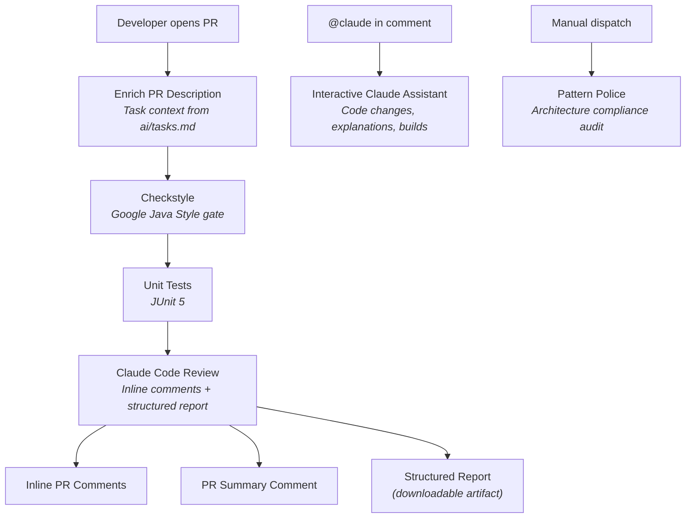

# Welcome to Bill-Manager-Actions Wiki

> A hands-on POC for automated code review using Claude Code Actions in GitHub CI pipelines — with path-specific review rules, structured reports, and on-demand architecture audits.

---

## What is This Project?

**Bill-Manager-Actions** is a Spring Boot 3.5.x application with a dual purpose:

1. **Primary:** Testing ground for [Claude Code Actions](https://github.com/anthropics/claude-code-action) automated code review in CI pipelines
2. **Secondary:** A working bill/receipt analysis app powered by LLMs (Groq API)

The CI/CD automation is the star of this project. The application exists to provide meaningful code for Claude to review — with distinct modules (`config/`, `upload/`, `ai/`) that exercise different review rules.

---

## Quick Navigation

### I Want to Understand the CI Pipeline

| Page | What You'll Learn |
|------|-------------------|
| [Pipeline Overview](02-Pipeline-Overview) | All 3 workflows at a glance — triggers, outputs, how they complement each other |
| [CI Pipeline Deep Dive](03-CI-Pipeline-Deep-Dive) | The 5-job chain: enrichment, checkstyle, tests, Claude review, cleanup |
| [Claude Code Review Job](05-Claude-Code-Review-Job) | Prompt anatomy, structured report format, artifact upload |
| [PR Enrichment and Task Workflow](06-PR-Enrichment-and-Task-Workflow) | How task context from `ai/tasks.md` feeds into the PR and review |

### I Want to Understand the Review Rules

| Page | What You'll Learn |
|------|-------------------|
| [CLAUDE.MD as Review Brain](04-CLAUDE-MD-as-Review-Brain) | Global scope, path-specific rules (ai/, upload/, config/), DO/DON'T split |
| [Checkstyle Configuration](10-Checkstyle-Configuration) | Google Java Style rules, `FinalParameters` quirk, pipeline gate role |

### I Want to Explore Other Workflows

| Page | What You'll Learn |
|------|-------------------|
| [Interactive Claude Assistant](07-Interactive-Claude-Assistant) | `@claude` mentions in PRs and issues |
| [Pattern Police](08-Pattern-Police) | On-demand architecture drift detection |

### I Want to Understand Security

| Page | What You'll Learn |
|------|-------------------|
| [Security and Permissions](09-Security-and-Permissions) | Tool whitelists, GitHub permissions, secrets, fork safety |

### I Want to Troubleshoot

| Page | What You'll Learn |
|------|-------------------|
| [Troubleshooting and Lessons Learned](13-Troubleshooting-and-Lessons-Learned) | Common problems with Claude Code Actions CI, root causes, fixes, and setup checklist |

### I Want to Contribute or Set Up Locally

| Page | What You'll Learn |
|------|-------------------|
| [Application Architecture](11-Application-Architecture) | Spring Boot app: packages, flow, REST API, data models |
| [Contributing Guide](12-Contributing-Guide) | Setup, branch naming, PR workflow, reading review artifacts |

---

## How the Automation Works (Overview)



**Three workflows, three purposes:**

| Workflow | Trigger | Purpose |
|----------|---------|---------|
| **CI Pipeline** (`ci.yml`) | Automatic on every PR | Quality gate: style, tests, AI review |
| **Interactive Claude** (`claude.yml`) | `@claude` mention | On-demand assistant for developers |
| **Pattern Police** (`pattern-police.yml`) | Manual dispatch | Architecture drift detection |

---

## Repository Structure

```
bill-manager-actions/
├── .github/
│   ├── workflows/
│   │   ├── ci.yml                    # CI Pipeline (5 jobs)
│   │   ├── claude.yml                # Interactive @claude mentions
│   │   └── pattern-police.yml        # Architecture audit
│   └── pull_request_template.md      # PR template with TASK_PLACEHOLDER
├── ai/                               # Project documentation
│   ├── prd.md                        # Product requirements
│   ├── tech-stack.md                 # Technology stack
│   ├── api-plan.md                   # REST API plan
│   └── tasks.md                      # Implementation tasks (CI enrichment source)
├── src/main/java/.../                # Spring Boot application
│   ├── config/                       # Configuration (→ Config Module rules)
│   ├── upload/                       # File handling (→ Upload Module rules)
│   ├── ai/                           # LLM integration (→ AI Module rules)
│   ├── dto/                          # Data models (Java Records)
│   └── exception/                    # Global error handling
├── CLAUDE.md                         # Review brain — rules for all workflows
├── checkstyle.xml                    # Google Java Style configuration
└── pom.xml                           # Maven build with Checkstyle plugin
```

---

## Key Concepts

| Concept | Description | Read More |
|---------|-------------|-----------|
| **Path-specific review rules** | Different CLAUDE.md rules for `ai/`, `upload/`, `config/` modules | [CLAUDE.MD as Review Brain](04-CLAUDE-MD-as-Review-Brain) |
| **`always()` pattern** | How CI jobs run even when dependencies are skipped | [CI Pipeline Deep Dive](03-CI-Pipeline-Deep-Dive) |
| **Task enrichment** | Branch name → task number → PR body injection | [PR Enrichment](06-PR-Enrichment-and-Task-Workflow) |
| **Structured report** | Markdown artifact with execution plan, findings, patches | [Claude Code Review Job](05-Claude-Code-Review-Job) |
| **`rerun` label** | Re-trigger full pipeline including enrichment | [CI Pipeline Deep Dive](03-CI-Pipeline-Deep-Dive) |
| **Tool whitelists** | `--allowedTools` for least-privilege access | [Security and Permissions](09-Security-and-Permissions) |
| **Troubleshooting** | Common CI problems and how to fix them | [Troubleshooting](13-Troubleshooting-and-Lessons-Learned) |

---

## Technology Stack

| Component | Technology | Version |
|-----------|-----------|---------|
| Runtime | Java | 17 (LTS) |
| Framework | Spring Boot | 3.5.10 |
| AI | Spring AI + Groq | 1.1.2 |
| Build | Maven (wrapper) | 3.9.12 |
| Linting | Checkstyle (Google Style) | 10.23.1 |
| CI/CD | GitHub Actions | — |
| Code Review | Claude Code Actions | v1 |

---

## External References

- [claude-code-action](https://github.com/anthropics/claude-code-action) — The GitHub Action powering all three workflows
- [Claude Code Actions Setup Guide](https://github.com/anthropics/claude-code-action/blob/main/docs/setup.md)
- [Claude Code Actions Configuration](https://github.com/anthropics/claude-code-action/blob/main/docs/configuration.md)

---

*Last updated: 2026-02-19*
