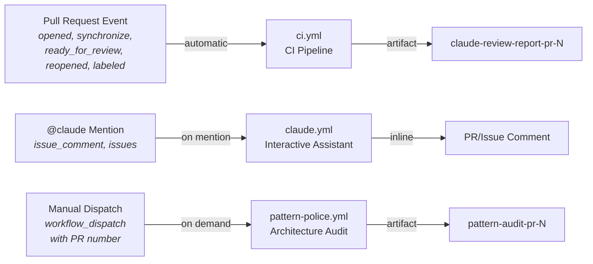
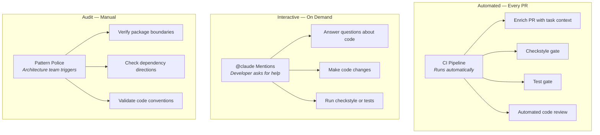

# Pipeline Overview

> Three GitHub Actions workflows form the automation backbone of this project: a CI pipeline for every PR, an interactive Claude assistant, and an on-demand architecture auditor.

---

## Table of Contents

- [Three Workflows, Three Purposes](#three-workflows-three-purposes)
- [Trigger Taxonomy](#trigger-taxonomy)
- [Workflow Comparison](#workflow-comparison)
- [How the Workflows Complement Each Other](#how-the-workflows-complement-each-other)
- [Artifacts and Outputs](#artifacts-and-outputs)
- [The Role of CLAUDE.md](#the-role-of-claudemd)
- [Related Pages](#related-pages)

---

## Three Workflows, Three Purposes

This project uses three separate GitHub Actions workflow files, each serving a distinct role:

| Workflow | File | Purpose |
|----------|------|---------|
| **CI Pipeline** | `.github/workflows/ci.yml` | Automated quality gate on every PR: enrichment, checkstyle, tests, Claude review |
| **Claude Interactive** | `.github/workflows/claude.yml` | On-demand assistant via `@claude` mentions in PRs and issues |
| **Pattern Police** | `.github/workflows/pattern-police.yml` | Manual architecture drift detection for any PR |

All three workflows use the same GitHub Action — [`anthropics/claude-code-action@v1`](https://github.com/anthropics/claude-code-action) — but with different prompts, permissions, and allowed tools.

---

## Trigger Taxonomy

Each workflow responds to different GitHub events:

**Key distinction:**
- **CI Pipeline** runs automatically on every PR event — no human action needed
- **Claude Interactive** requires an explicit `@claude` mention in a comment
- **Pattern Police** requires manual trigger from the Actions tab with a PR number

---

## Workflow Comparison

| Aspect | CI Pipeline | Interactive Claude | Pattern Police |
|--------|------------|-------------------|----------------|
| **Trigger** | `pull_request` events | `@claude` mention | Manual dispatch |
| **Automatic?** | Yes | No (needs mention) | No (manual) |
| **Jobs** | 5 (enrich → checkstyle → test → review → cleanup) | 1 (claude) | 1 (pattern-check) |
| **Can modify code?** | No (read-only + report) | Yes (Read/Write/Edit) | No (report only) |
| **Can search codebase?** | Yes (Glob/Grep/Read — limited) | Yes (all tools) | No (diff only) |
| **Can run tests?** | Yes (dedicated job) | Yes (`./mvnw test`) | No |
| **Produces artifact?** | Yes (`claude-review-report-pr-N`) | No | Yes (`pattern-audit-pr-N`) |
| **Uses CLAUDE.md rules?** | Yes (path-specific) | Yes (automatic) | Yes (explicit read) |
| **Checkout depth** | Full history (`fetch-depth: 0`) | Shallow (`fetch-depth: 1`) | Full history (`fetch-depth: 0`) |

---

## How the Workflows Complement Each Other

The three workflows cover different stages of the development lifecycle:

**Typical developer flow:**

1. Push code to PR branch → **CI Pipeline** runs automatically
2. Read Claude's review comments and structured report
3. If something is unclear → mention `@claude` in PR comment for clarification (**Interactive**)
4. If the PR touches architecture boundaries → run **Pattern Police** from the Actions tab
5. Push fixes → **CI Pipeline** runs again (checkstyle → test → review)

---

## Artifacts and Outputs

| Artifact | Created By | Download From | Content |
|----------|-----------|---------------|---------|
| `claude-review-report-pr-{N}` | CI Pipeline (`claude-review` job) | Actions → Run → Artifacts | Structured markdown review report |
| `pattern-audit-pr-{N}` | Pattern Police (`pattern-check` job) | Actions → Run → Artifacts | Architecture compliance audit |

Both artifacts are uploaded only if the `reports/` directory contains files after the Claude action completes. They can be downloaded from the GitHub Actions run summary page.

The **Interactive Claude** workflow does not produce artifacts — it responds directly as comments on the PR or issue.

---

## The Role of CLAUDE.md

`CLAUDE.md` is the single source of truth for review behavior across all three workflows. Claude automatically reads it on every invocation.

| CLAUDE.md Section | Used By |
|-------------------|---------|
| Global Review Scope (DO/DON'T review) | CI Pipeline, Interactive Claude |
| Path-Specific Rules (`ai/`, `upload/`, `config/`) | CI Pipeline, Pattern Police |
| Code Conventions (`final`, Records, interfaces) | All three workflows |
| Build Commands | Interactive Claude (allowed to run `./mvnw`) |

For a deep dive into how CLAUDE.md controls review behavior, see [CLAUDE.MD as Review Brain](04-CLAUDE-MD-as-Review-Brain).

---

## Related Pages

- [CI Pipeline Deep Dive](03-CI-Pipeline-Deep-Dive) — Complete walkthrough of the 5-job CI pipeline
- [CLAUDE.MD as Review Brain](04-CLAUDE-MD-as-Review-Brain) — How review rules are structured
- [Claude Code Review Job](05-Claude-Code-Review-Job) — Deep dive into the automated review job
- [Interactive Claude Assistant](07-Interactive-Claude-Assistant) — How @claude mentions work
- [Pattern Police](08-Pattern-Police) — On-demand architecture audit
- [Security and Permissions](09-Security-and-Permissions) — Tool restrictions and least-privilege access

---

*Last updated: 2026-02-20*

*Sources: `.github/workflows/ci.yml`, `.github/workflows/claude.yml`, `.github/workflows/pattern-police.yml`, `docs/claude-actions-context.md`*
