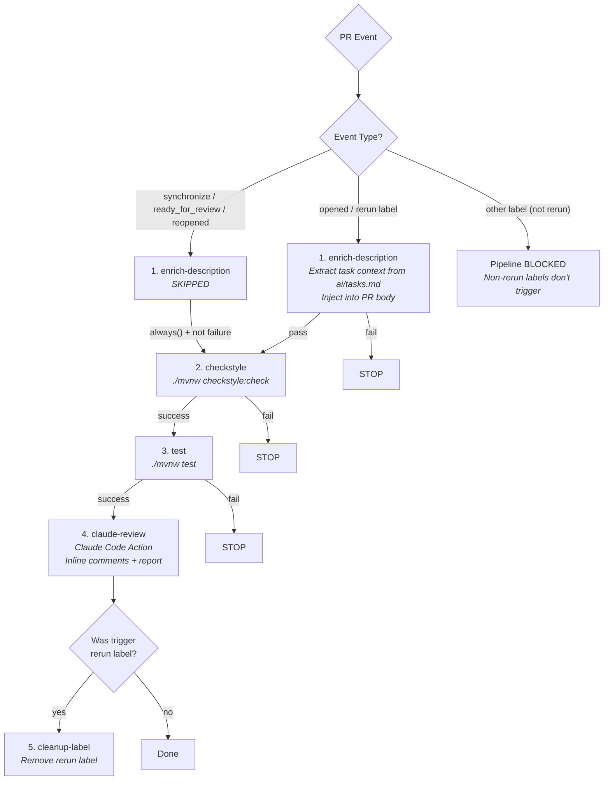
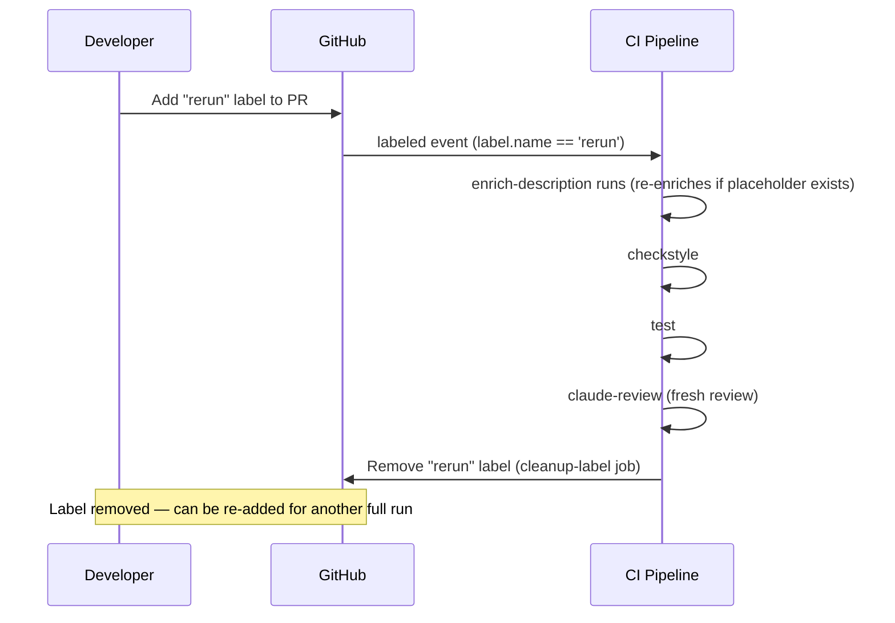

# CI Pipeline Deep Dive

> The CI pipeline (`ci.yml`) is the heart of this project — a 5-job chain that enriches PR descriptions, enforces code style, runs tests, and triggers AI-powered code review on every pull request.

---

## Table of Contents

- [Pipeline Trigger Events](#pipeline-trigger-events)
- [The Five Jobs](#the-five-jobs)
- [Job Dependency Chain and Conditional Logic](#job-dependency-chain-and-conditional-logic)
- [The always() Pattern Explained](#the-always-pattern-explained)
- [Two Execution Paths](#two-execution-paths)
- [Rerun Label Lifecycle](#rerun-label-lifecycle)
- [Job Details](#job-details)
  - [enrich-description](#job-1-enrich-description)
  - [checkstyle](#job-2-checkstyle)
  - [test](#job-3-test)
  - [claude-review](#job-4-claude-review)
  - [cleanup-label](#job-5-cleanup-label)
- [Failure Propagation](#failure-propagation)
- [Permissions Summary](#permissions-summary)
- [Related Pages](#related-pages)

---

## Pipeline Trigger Events

The pipeline triggers on `pull_request` events with these types:

```yaml
on:
  pull_request:
    types: [opened, synchronize, ready_for_review, reopened, labeled]
```

| Event Type | When It Fires | What Runs |
|-----------|---------------|-----------|
| `opened` | New PR created | Full pipeline (all 5 jobs) |
| `synchronize` | Code pushed to PR branch | Checkstyle → Test → Claude Review (enrichment skipped) |
| `ready_for_review` | Draft PR marked as ready | Checkstyle → Test → Claude Review (enrichment skipped) |
| `reopened` | Closed PR reopened | Checkstyle → Test → Claude Review (enrichment skipped) |
| `labeled` | Label added to PR | Full pipeline only if label is `rerun`; blocked otherwise |

---

## The Five Jobs



| Job | Name | Purpose |
|-----|------|---------|
| 1 | `enrich-description` | Extract task number from branch name, parse `ai/tasks.md`, inject context into PR body |
| 2 | `checkstyle` | Run Spotless (formatting) + Checkstyle (code rules) — Google Java Style enforcement |
| 3 | `test` | Run `./mvnw test` — JUnit 5 unit tests |
| 4 | `claude-review` | Automated AI code review with structured report |
| 5 | `cleanup-label` | Remove the `rerun` label after pipeline completes |

---

## Job Dependency Chain and Conditional Logic

Each job declares its dependency and condition. Here is the exact YAML for each job's `needs` and `if`:

```yaml
# Job 1: enrich-description
if: >-
  github.event.action == 'opened' ||
  (github.event.action == 'labeled' && github.event.label.name == 'rerun')

# Job 2: checkstyle
needs: enrich-description
if: >-
  always() &&
  needs.enrich-description.result != 'failure' &&
  (github.event.action != 'labeled' || github.event.label.name == 'rerun')

# Job 3: test
needs: checkstyle
if: always() && needs.checkstyle.result == 'success'

# Job 4: claude-review
needs: test
if: always() && needs.test.result == 'success'

# Job 5: cleanup-label
needs: [enrich-description, checkstyle, test, claude-review]
if: always() && github.event.action == 'labeled' && github.event.label.name == 'rerun'
```

---

## The always() Pattern Explained

By default, GitHub Actions **skips** a job if its dependency was skipped. This is a problem because `enrich-description` is skipped on `synchronize` events — without `always()`, the entire pipeline would stop.

The `always()` function overrides this behavior:

| Condition | Meaning |
|-----------|---------|
| `always()` | Run regardless of dependency status (success, failure, or skipped) |
| `always() && needs.X.result != 'failure'` | Run if dependency succeeded OR was skipped (but not if it failed) |
| `always() && needs.X.result == 'success'` | Run only if dependency explicitly succeeded |

**Why `checkstyle` uses `!= 'failure'` instead of `== 'success'`:**

When `enrich-description` is skipped (on `synchronize`), its result is `'skipped'` — not `'success'`. Using `== 'success'` would incorrectly block checkstyle. Using `!= 'failure'` allows it to proceed when enrichment is either successful or skipped.

**Why `test` and `claude-review` use `== 'success'`:**

Checkstyle and tests should never be skipped — they must explicitly pass. Using `== 'success'` ensures a strict gate: if checkstyle fails, tests don't run; if tests fail, review doesn't run.

---

## Two Execution Paths

### Path A: PR Opened or Rerun Label

All 5 jobs run in sequence:

```
enrich-description → checkstyle → test → claude-review → cleanup-label*
```

*cleanup-label only runs on rerun label events

### Path B: Code Pushed (synchronize)

Enrichment is skipped, remaining jobs run:

```
(enrich-description: SKIPPED) → checkstyle → test → claude-review
```

### Why Enrichment is Skipped on Push

The `enrich-description` job replaces the `<!-- TASK_PLACEHOLDER -->` marker in the PR body. This only needs to happen once — when the PR is first created. Subsequent code pushes don't need to re-enrich the description because:

1. The placeholder has already been replaced
2. The task context doesn't change between pushes
3. Re-running would be a no-op (placeholder already gone)

---

## Rerun Label Lifecycle

The `rerun` label provides a mechanism to re-trigger the full pipeline, including enrichment:



**Key behaviors:**
- Adding any label *other than* `rerun` does **not** trigger the pipeline (blocked by the checkstyle `if` condition)
- The `rerun` label is automatically removed after the pipeline completes
- The label can be re-added as many times as needed
- This is useful when you want a fresh Claude review without pushing new code

---

## Job Details

### Job 1: enrich-description

**Purpose:** Populate the PR body with task context from `ai/tasks.md`.

**Steps:**
1. **Checkout** — Standard repository checkout
2. **Extract task number** — Regex `task-([0-9]+)` on the branch name
3. **Build task content** — Parse `ai/tasks.md` for the task's title, description, scope, review rules, and expected review points
4. **Update PR description** — Replace `<!-- TASK_PLACEHOLDER -->` in the PR body with the extracted content

**Graceful degradation:**
- No task number in branch name → warning injected
- `ai/tasks.md` not found → warning injected
- Task number not found in file → warning injected
- Placeholder already replaced → silently skipped

For the full enrichment algorithm, see [PR Enrichment and Task Workflow](06-PR-Enrichment-and-Task-Workflow).

---

### Job 2: checkstyle

**Purpose:** Enforce code formatting (Spotless) and Google Java Style (Checkstyle).

**Steps:**
1. **Checkout** repository
2. **Set up JDK 17** (Temurin distribution, Maven cache enabled)
3. **Check formatting (Spotless)** — `./mvnw spotless:check` (Google Java Format, 2-space indent)
4. **Run Checkstyle** — `./mvnw checkstyle:check`

**Blocking behavior:** If any Spotless or Checkstyle violation is found, the job fails and the pipeline stops. Tests and Claude review will not run.

For the full Checkstyle configuration, see [Checkstyle Configuration](10-Checkstyle-Configuration).

---

### Job 3: test

**Purpose:** Run the JUnit 5 test suite.

**Steps:**
1. **Checkout** repository
2. **Set up JDK 17** (Temurin distribution, Maven cache enabled)
3. **Run Tests** — `./mvnw test`

**Blocking behavior:** If any test fails, the pipeline stops. Claude review will not run on code with failing tests.

---

### Job 4: claude-review

**Purpose:** Automated AI code review with structured reporting.

**Steps:**
1. **Checkout** with full history (`fetch-depth: 0`) for comprehensive diff analysis
2. **Claude Code Action** — Invokes `anthropics/claude-code-action@v1` with a detailed prompt
3. **Upload report** — Saves the structured review report as a GitHub Actions artifact

**Key configuration:**
- Allowed tools: `Glob`, `Grep`, `Read`, inline comments, `gh pr` commands, `Write` (for reports)
- Claude may read related files (interfaces, callers) beyond the diff — max 5 extra file reads
- Claude cannot modify source code — only writes to `reports/`
- `--max-turns 20` limits token consumption per review
- `use_sticky_comment: true` — edits a single comment instead of posting new ones on each push
- Uses `CLAUDE_CODE_OAUTH_TOKEN` secret for authentication

For the full review prompt and report format, see [Claude Code Review Job](05-Claude-Code-Review-Job).

---

### Job 5: cleanup-label

**Purpose:** Remove the `rerun` label so it can be reused.

**Runs only when:** `github.event.action == 'labeled' && github.event.label.name == 'rerun'`

**Dependencies:** Waits for ALL four preceding jobs to complete (success, failure, or skip).

**Steps:**
1. **Remove label** — `gh pr edit --remove-label "rerun"`

---

## Failure Propagation

| Job That Fails | Effect on Pipeline |
|---------------|-------------------|
| `enrich-description` | Checkstyle, tests, and review are **blocked** |
| `checkstyle` | Tests and review are **blocked** |
| `test` | Review is **blocked** |
| `claude-review` | Pipeline completes (review is the last quality job) |
| `cleanup-label` | No impact (independent cleanup) |

**Design principle:** Each quality gate must pass before the next one runs. There's no point in running an AI code review on code that doesn't compile or has failing tests.

### Workflow File Validation (Expected Failure)

Claude Code Action validates that `ci.yml` on the PR branch matches the version on `master`. PRs that modify `ci.yml` will **always fail** the `claude-review` job with a workflow validation error. This is a security feature, not a bug.

**Workaround:** Merge with `gh pr merge <N> --squash --admin`. After merge, subsequent PRs pass because `master` now has the updated workflow.

---

## Permissions Summary

| Job | `contents` | `pull-requests` | `issues` | `id-token` |
|-----|-----------|-----------------|----------|------------|
| enrich-description | read | write | — | — |
| checkstyle | — | — | — | — |
| test | — | — | — | — |
| claude-review | read | write | — | write |
| cleanup-label | — | write | — | — |

**Why `id-token: write`?** Required by the Claude Code Action for OAuth token exchange with the Anthropic API.

---

## Related Pages

- [Pipeline Overview](02-Pipeline-Overview) — Bird's-eye view of all three workflows
- [CLAUDE.MD as Review Brain](04-CLAUDE-MD-as-Review-Brain) — Review rules that guide the claude-review job
- [Claude Code Review Job](05-Claude-Code-Review-Job) — Deep dive into the review prompt and report format
- [PR Enrichment and Task Workflow](06-PR-Enrichment-and-Task-Workflow) — How the enrich-description job works
- [Checkstyle Configuration](10-Checkstyle-Configuration) — What the checkstyle job enforces
- [Security and Permissions](09-Security-and-Permissions) — Tool restrictions and permissions explained
- [Troubleshooting and Lessons Learned](13-Troubleshooting-and-Lessons-Learned) — Common pipeline problems (`always()` pattern, workflow validation, shell interpolation)

---

*Last updated: 2026-02-20*

*Sources: `.github/workflows/ci.yml` (complete file), `CLAUDE.md` (pipeline diagram)*
