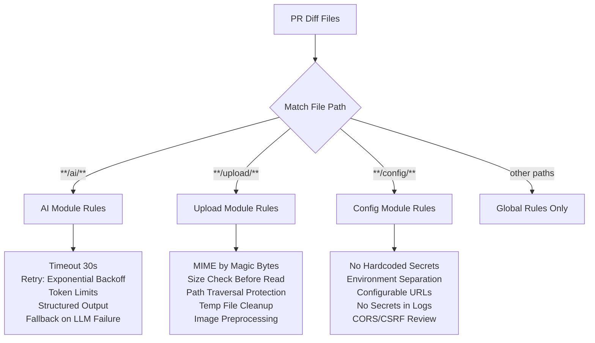
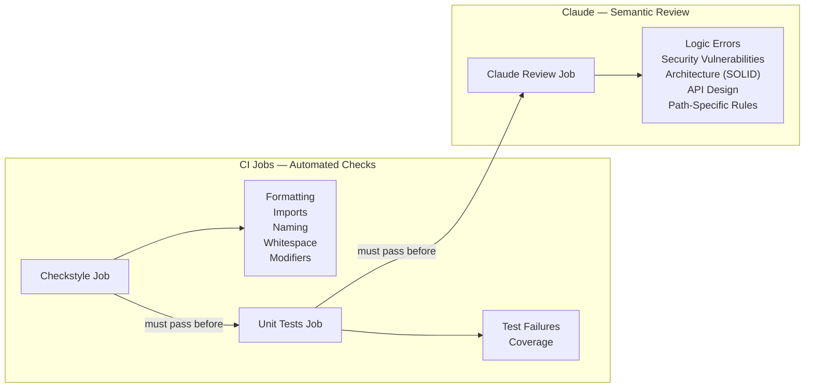

# CLAUDE.MD as Review Brain

> CLAUDE.md is the single source of truth that controls what Claude reviews, what it ignores, and which rules apply to which modules — the "brain" behind every automated review.

---

## Table of Contents

- [CLAUDE.md as Single Source of Truth](#claudemd-as-single-source-of-truth)
- [How Claude Reads CLAUDE.md](#how-claude-reads-claudemd)
- [Global Review Scope](#global-review-scope)
- [Path-Specific Review Rules](#path-specific-review-rules)
- [The CI vs Claude Responsibility Split](#the-ci-vs-claude-responsibility-split)
- [Review Style Guidelines](#review-style-guidelines)
- [Review Mapping Table](#review-mapping-table)
- [Evolving the Rules](#evolving-the-rules)
- [Related Pages](#related-pages)

---

## CLAUDE.md as Single Source of Truth

Every Claude Code Actions invocation — whether automated CI review, interactive `@claude` mention, or Pattern Police audit — reads `CLAUDE.md` from the repository root. This file defines:

- **What to review** — logic, security, architecture, error handling
- **What to skip** — formatting, test failures, import ordering (handled by CI tools)
- **Module-specific rules** — different checks for `ai/`, `upload/`, and `config/` packages
- **Code conventions** — Java Records, `final` modifier usage, interface patterns
- **Build commands** — how to compile, test, and lint the project

This means changing review behavior is as simple as editing `CLAUDE.md` and pushing a commit — no workflow YAML changes needed.

---

## How Claude Reads CLAUDE.md

Claude Code Action (`anthropics/claude-code-action@v1`) has built-in behavior:

> "Always check for and follow the repository's CLAUDE.md file(s) as they contain repo-specific instructions and guidelines."

This happens automatically. The CI pipeline prompt additionally directs Claude to pay attention to specific sections:

```
Apply the code review guidelines from CLAUDE.md, including:
- Global review scope (what to review and what to skip)
- Path-specific rules for ai/, upload/, and config/ packages
```

Claude also has access to the full repository, so it can read supplementary documentation in `./ai/` and `./docs/` if referenced.

---

## Global Review Scope

The global scope applies to **all code in every PR**, regardless of which module is affected.

### What Claude Reviews (DO Review)

| Category | Examples |
|----------|---------|
| **Logical errors** | Null checks, boundary conditions, race conditions |
| **Security vulnerabilities** | Injection attacks, improper input validation, secrets exposure |
| **API design** | REST conventions, error responses, proper HTTP status codes |
| **Performance** | N+1 queries, missing pagination, inefficient algorithms |
| **Architecture** | Proper use of interfaces, dependency injection, separation of concerns |
| **Error handling** | Appropriate exception types, meaningful error messages |

### What Claude Skips (DON'T Review)

These are handled by dedicated CI jobs that run *before* Claude's review:

| Handled By | What |
|------------|------|
| **Checkstyle** (CI job) | Code formatting, import ordering, naming conventions, line length, missing semicolons |
| **Unit Tests** (CI job) | Test failures, code coverage |

This separation is intentional — Claude should spend its review cycles on things that require understanding code semantics, not enforcing style rules that a linter handles better.

### Project-Specific Requirements

- All DTOs must use **Java Records**, not classes with getters/setters
- Use `ChatModel` and `ChatClient` interfaces from Spring AI (never raw HTTP clients)
- API keys must come from environment variables or secrets manager
- Never log request/response bodies that may contain sensitive data
- Validate all file uploads for MIME type and size

---

## Path-Specific Review Rules

When a PR modifies files in specific packages, Claude applies additional rules on top of the global scope. This is the key innovation — rules are scoped by file path.



### AI Module (`**/ai/**`) — LLM Integration

Every Groq API call must have:

| Rule | Requirement |
|------|-------------|
| **Timeout** | Explicit 30-second timeout on every API call |
| **Retry** | Exponential Backoff: 1s initial delay, max 3 retries, 2x multiplier |
| **Token Limits** | Prompt size validation before sending, response token limits in options |
| **Error Handling** | Catch `ChatClientException` and subtypes, provide fallback when LLM unavailable |
| **Structured Output** | Use `BeanOutputConverter` or equivalent, validate parsed output before returning |
| **No Raw Errors** | Never expose raw API errors to users |

### Upload Module (`**/upload/**`) — File Handling

| Rule | Requirement |
|------|-------------|
| **MIME Validation** | Validate by file content (magic bytes), NOT by extension or `Content-Type` header |
| **Allowed Types** | `image/jpeg`, `image/png`, `application/pdf` only |
| **File Size** | Max 10MB, check BEFORE reading entire file into memory |
| **Path Traversal** | Sanitize filenames: remove `..`, path separators, verify path stays within upload dir |
| **Temp Files** | Delete after processing, use try-with-resources |
| **Preprocessing** | Resize images to max 1200px width, strip EXIF metadata |

### Config Module (`**/config/**`) — Security and Secrets

| Rule | Requirement |
|------|-------------|
| **Secrets** | NEVER allow hardcoded API keys, passwords, tokens. No default values for sensitive properties |
| **Environment Separation** | `application.properties` for defaults only, env vars for all secrets |
| **Logging** | API keys must never appear in logs, mask sensitive data |
| **External Services** | Base URLs must be configurable, explicit timeout values |
| **Security Beans** | Review CORS (not overly permissive), CSRF settings, auth configuration |

---

## The CI vs Claude Responsibility Split

This diagram shows how the pipeline divides responsibilities between automated CI tools and Claude's AI review:



**Why this split matters:** Checkstyle and tests produce deterministic pass/fail results. Claude's review adds value where automated tools fall short — understanding code intent, catching logical errors, and verifying architectural compliance.

---

## Review Style Guidelines

CLAUDE.md also specifies how Claude should communicate review findings:

- **Be concise and actionable** — no verbose explanations
- **Focus on "why"** something is problematic, not just "what"
- **Suggest specific fixes** when possible (unified diff patches in the report)
- **Prioritize security and correctness** over style preferences
- **Write in English** when running as a GitHub Action

---

## Review Mapping Table

Each CLAUDE.md review section is exercised by specific tasks (PRs):

| Review Section | Tasks | Key Review Points |
|---------------|-------|-------------------|
| Global review scope | 2, 3, 5, 10, 11, 13 | Architecture, Records, REST conventions, workflow quality, CI security |
| Config Module rules | 4, 12 | Secrets, env separation, configurable URLs, Jira API secrets |
| Upload Module rules | 6, 7, 8 | MIME validation, size limits, path traversal, preprocessing |
| AI Module rules | 9 | Timeout, retry, exponential backoff, structured output |

This mapping ensures every review rule set is exercised in at least one PR, validating that the rules produce meaningful findings.

---

## Evolving the Rules

CLAUDE.md is a living document. The project follows a **Continuous Learning Loop**:

1. **Detect** conflicting instructions, new requirements, or inaccurate documentation
2. **Propose a specific update** to the relevant CLAUDE.md section
3. **Do NOT apply the update** until the team confirms
4. **After the update**, retry the original review

This means review quality improves over time as rules are refined based on real PR findings.

---

## Related Pages

- [Pipeline Overview](02-Pipeline-Overview) — How all three workflows use CLAUDE.md
- [Claude Code Review Job](05-Claude-Code-Review-Job) — How the CI review job applies these rules
- [Pattern Police](08-Pattern-Police) — How the architecture audit reads and enforces these rules
- [Security and Permissions](09-Security-and-Permissions) — Tool restrictions that complement the review rules

---

*Last updated: 2026-02-19*

*Sources: `CLAUDE.md` (Review Scope, Path-Specific Rules, Code Conventions), `docs/claude-actions-context.md`, `ai/tasks.md` (Review Mapping table)*
