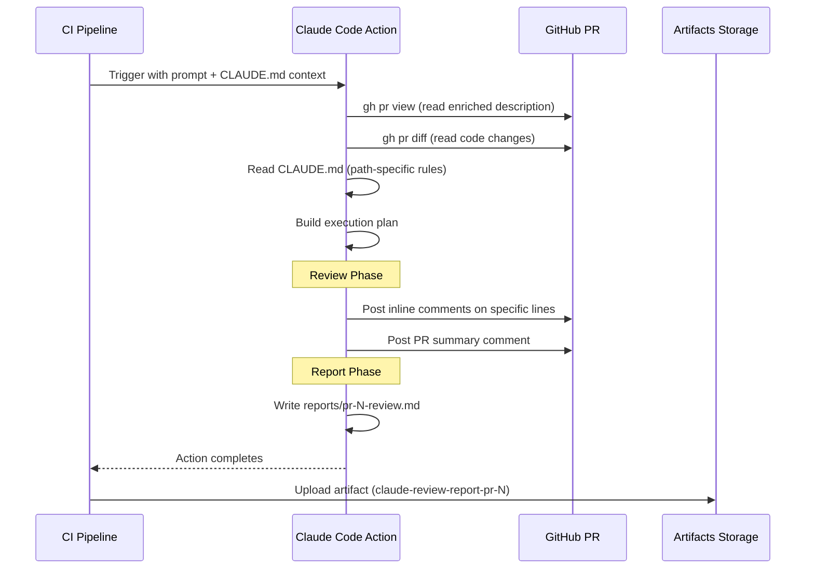

# Claude Code Review Job

> The `claude-review` job is the flagship of the CI pipeline — it invokes Claude Code Action with a carefully crafted prompt to produce inline comments, a PR summary, and a structured markdown report uploaded as a downloadable artifact.

---

## Table of Contents

- [The Review Job in the Pipeline](#the-review-job-in-the-pipeline)
- [Prompt Anatomy](#prompt-anatomy)
- [Review Workflow](#review-workflow)
- [Structured Report Format](#structured-report-format)
- [Task Context: How PR Description Feeds the Review](#task-context-how-pr-description-feeds-the-review)
- [Artifact Upload and Download](#artifact-upload-and-download)
- [Tool Restrictions](#tool-restrictions)
- [Related Pages](#related-pages)

---

## The Review Job in the Pipeline

The `claude-review` job is the 4th job in the CI pipeline, gated behind both `checkstyle` and `test`:

```yaml
claude-review:
  name: Claude Code Review
  needs: test
  if: always() && needs.test.result == 'success'
```

This means Claude only reviews code that:
1. Passes Checkstyle (no formatting violations)
2. Passes all unit tests

This is intentional — there's no point in AI review of code that doesn't compile or has failing tests.

**Known limitation:** Claude Code Action validates that the workflow file (`ci.yml`) on the PR branch is identical to the version on `master`. PRs that modify `ci.yml` will always fail this job. Workaround: merge with `--admin` flag. See [CI Pipeline Deep Dive — Workflow File Validation](03-CI-Pipeline-Deep-Dive#workflow-file-validation-expected-failure).

---

## Prompt Anatomy

The review prompt is embedded directly in `ci.yml`. Here's a breakdown of each section:

### Context Variables

```yaml
prompt: |
  REPO: ${{ github.repository }}
  PR NUMBER: ${{ github.event.pull_request.number }}
```

Claude receives the repository name and PR number as structured input.

### Role Assignment

```
You are a Senior Java Developer reviewing this Pull Request.
```

### Token Budget Rules

```
- Use `gh pr diff` as your PRIMARY source of changes
- Use `Read` tool for file contents — NEVER use `gh api` to read files
- Use `Write` tool to create report files — it auto-creates directories, no `mkdir` needed
- You MAY read related files (interfaces, parent classes, callers, test counterparts)
  when needed to verify correctness — keep it targeted (max 5 extra file reads)
- Use `Grep`/`Glob` to find related code — this is cheaper than reading full files
- Do NOT read unrelated files (README, wiki/, build configs not in the diff)
```

These rules minimize token usage by directing Claude to use the diff as primary input and limiting extra file reads.

### Context Gathering (ordered)

```
1. Run `gh pr view` to read PR description and task context
2. Run `gh pr diff` to get the full diff
3. Read CLAUDE.md for review rules (this file is always relevant)
4. Only then use `Read` for specific files if the diff alone is insufficient
```

This tells Claude to read the enriched PR description before starting the review, ensuring it knows what the PR is supposed to accomplish and what findings are expected.

### Review Rules Reference

```
Apply the code review guidelines from CLAUDE.md, including:
- Global review scope (what to review and what to skip)
- Path-specific rules for ai/, upload/, and config/ packages
```

### Exclusion Rules

```
DO NOT comment on formatting issues (handled by Checkstyle CI job).
DO NOT comment on test failures (handled by test CI job).
```

### Review Workflow Steps

The prompt defines a 4-step workflow:

1. **Execution Plan** — List which checks to perform and which files to examine
2. **Inline Review** — Post inline comments on specific code issues
3. **PR Summary** — Post a top-level PR comment with overall assessment
4. **Structured Report** — Write a markdown report to `reports/pr-{N}-review.md`

### Safety Constraints

```
## Safety
- Do NOT modify any source files — only write the report under reports/
- Do NOT run build, test, or formatting commands
- Do NOT push or commit changes
```

---

## Review Workflow



**What Claude produces:**

| Output | Where | Format |
|--------|-------|--------|
| Inline comments | On specific PR lines | GitHub inline review comments |
| PR summary | Top-level PR comment | Markdown comment |
| Structured report | `reports/pr-{N}-review.md` | Markdown file (artifact) |

---

## Structured Report Format

The report written to `reports/pr-{N}-review.md` follows this structure:

### 1. Execution Plan

What Claude checked and why — which files were examined, which rules were applied.

### 2. Summary

High-level assessment of the PR.

### 3. Strengths

What the PR does well.

### 4. Risks / Potential Bugs

Logical errors, security issues, edge cases, or architectural concerns found.

### 5. Path-Specific Rule Compliance

Only for affected paths — checks against the rules defined in [CLAUDE.MD as Review Brain](04-CLAUDE-MD-as-Review-Brain):

- **AI Module** (`**/ai/**`) — timeout, retry, token limits, structured output
- **Upload Module** (`**/upload/**`) — MIME validation, size checks, path traversal
- **Config Module** (`**/config/**`) — secrets, env separation, configurable URLs

### 6. Suggested Patches

Minimal code changes as unified diff blocks:

````markdown
```diff
- old code
+ suggested fix
```
````

### 7. Next Actions

Prioritized list of what the PR author should address.

---

## Task Context: How PR Description Feeds the Review

The review prompt instructs Claude to read the PR description before starting. Thanks to the [enrich-description job](06-PR-Enrichment-and-Task-Workflow), the PR body contains:

```markdown
## Task Reference

### Task 7: Upload REST Controller + Error Handling

**Description:** Controller with endpoints POST /api/bills/upload and GET /api/bills/{id}.
Global exception handler with @ControllerAdvice.

**Scope:**
- New: src/main/java/.../upload/BillUploadController.java
- New: src/main/java/.../exception/GlobalExceptionHandler.java
- ...

**Claude review:** CLAUDE.md Upload Module review rules

**Expected review points:**
- [ ] Correct REST conventions (HTTP codes, Content-Type)
- [ ] Input validation at controller level
- [ ] Standardized error responses (ErrorResponse)
- [ ] No internal stacktraces exposed to users
```

Claude uses this as a **review checklist** — it knows what the PR is supposed to accomplish and what findings are expected. This creates a closed feedback loop between task planning and review execution.

---

## Artifact Upload and Download

After Claude writes the report, the CI pipeline uploads it as a GitHub Actions artifact:

```yaml
- name: Upload review report
  if: ${{ hashFiles('reports/**') != '' }}
  uses: actions/upload-artifact@v4
  with:
    name: claude-review-report-pr-${{ github.event.pull_request.number }}
    path: reports/**
```

**Key details:**
- Artifact is named `claude-review-report-pr-{N}` (e.g., `claude-review-report-pr-7`)
- Only uploaded if `reports/` directory has files (conditional on `hashFiles`)
- Available for download from the GitHub Actions run summary page
- Default retention: 90 days

**To download:** Go to the PR → Checks → CI Pipeline run → Artifacts section → Download `claude-review-report-pr-{N}`

---

## Tool Restrictions

The claude-review job has a strict `allowedTools` whitelist:

```yaml
claude_args: |
  --max-turns 20
  --allowedTools "Glob,Grep,Read,
                  mcp__github_inline_comment__create_inline_comment,
                  Bash(gh pr comment:*),
                  Bash(gh pr diff:*),
                  Bash(gh pr view:*),
                  Write"
```

| Tool | Purpose |
|------|---------|
| `Glob` | Find files by pattern (e.g., locate interfaces, test counterparts) |
| `Grep` | Search code patterns (e.g., find callers of a changed method) |
| `Read` | Read full file content (limited by token budget — max 5 files beyond diff) |
| `mcp__github_inline_comment__create_inline_comment` | Post inline comments on specific PR lines |
| `Bash(gh pr comment:*)` | Post top-level PR comments |
| `Bash(gh pr diff:*)` | Read the PR diff |
| `Bash(gh pr view:*)` | Read PR metadata and description |
| `Write` | Write the structured report file |

Additional configuration:
- `--max-turns 20` — limits the number of agentic turns to control token consumption
- `use_sticky_comment: true` — edits a single PR comment instead of posting new ones on each push

**What Claude CANNOT do in this job:**
- Edit source files (no `Edit` tool)
- Run tests or checkstyle
- Execute arbitrary bash commands
- Push code or modify branches

For a full comparison of tool restrictions across all workflows, see [Security and Permissions](09-Security-and-Permissions).

---

## Related Pages

- [CI Pipeline Deep Dive](03-CI-Pipeline-Deep-Dive) — Where the review job sits in the pipeline
- [CLAUDE.MD as Review Brain](04-CLAUDE-MD-as-Review-Brain) — The rules that guide the review
- [PR Enrichment and Task Workflow](06-PR-Enrichment-and-Task-Workflow) — How task context reaches the review
- [Security and Permissions](09-Security-and-Permissions) — Tool restrictions explained
- [Troubleshooting and Lessons Learned](13-Troubleshooting-and-Lessons-Learned) — Token overflow, tool permission denials, missing search tools

---

*Last updated: 2026-02-20*

*Sources: `.github/workflows/ci.yml` (lines 176–245), `CLAUDE.md` (Review Scope), `ai/tasks.md` (expected review points examples)*
