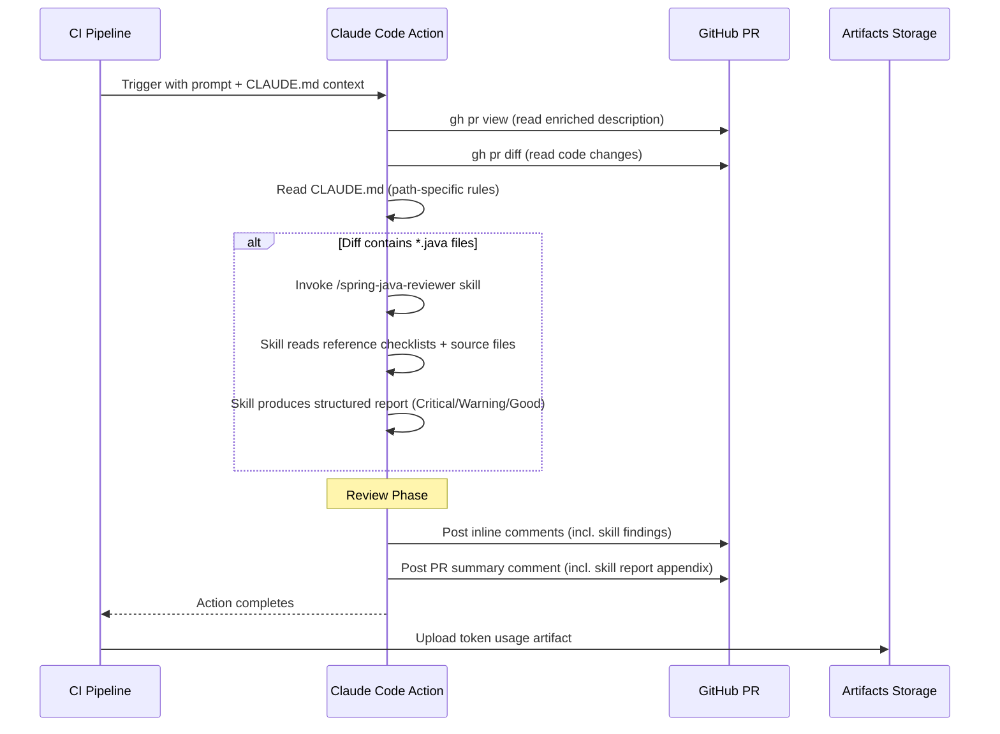

# Claude Code Review Job

> The `claude-review` job is the flagship of the CI pipeline — it invokes Claude Code Action with a carefully crafted prompt to produce inline comments, a PR summary, and a structured markdown report uploaded as a downloadable artifact.

---

## Table of Contents

- [The Review Job in the Pipeline](#the-review-job-in-the-pipeline)
- [Prompt Anatomy](#prompt-anatomy)
- [Review Workflow](#review-workflow)
- [Review Output Format](#review-output-format)
- [Task Context: How PR Description Feeds the Review](#task-context-how-pr-description-feeds-the-review)
- [Token Usage Tracking](#token-usage-tracking)
- [Artifact Upload and Download](#artifact-upload-and-download)
- [Tool Restrictions](#tool-restrictions)
- [Related Pages](#related-pages)

---

## The Review Job in the Pipeline

The `claude-review` job is the 4th job in the CI pipeline, gated behind both `checkstyle` and `test`:

```yaml
claude-review:
  name: Claude Code Review
  needs: test
  if: always() && needs.test.result == 'success'
```

This means Claude only reviews code that:
1. Passes Checkstyle (no formatting violations)
2. Passes all unit tests

This is intentional — there's no point in AI review of code that doesn't compile or has failing tests.

**Known limitation:** Claude Code Action validates that the workflow file (`ci.yml`) on the PR branch is identical to the version on `master`. PRs that modify `ci.yml` will always fail this job. Workaround: merge with `--admin` flag. See [CI Pipeline Deep Dive — Workflow File Validation](03-CI-Pipeline-Deep-Dive#workflow-file-validation-expected-failure).

---

## Prompt Anatomy

The review prompt is embedded directly in `ci.yml`. Here's a breakdown of each section:

### Context Variables

```yaml
prompt: |
  REPO: ${{ github.repository }}
  PR NUMBER: ${{ github.event.pull_request.number }}
```

Claude receives the repository name and PR number as structured input.

### Role Assignment

```
You are a Senior Java Developer reviewing this Pull Request.
```

### Token Budget Rules

```
- Use `gh pr diff` as your PRIMARY source of changes
- Use `Read` tool for file contents — NEVER use `gh api` to read files
- You MAY read related files (interfaces, parent classes, callers, test counterparts)
  when needed to verify correctness — keep it targeted (max 5 extra file reads)
- Use `Grep`/`Glob` to find related code — this is cheaper than reading full files
- Do NOT read unrelated files (README, wiki/, build configs not in the diff)
```

These rules minimize token usage by directing Claude to use the diff as primary input and limiting extra file reads.

### Context Gathering (ordered)

```
1. Run `gh pr view` to read PR description and task context
2. Run `gh pr diff` to get the full diff
3. Read CLAUDE.md for review rules (this file is always relevant)
4. Only then use `Read` for specific files if the diff alone is insufficient
```

This tells Claude to read the enriched PR description before starting the review, ensuring it knows what the PR is supposed to accomplish and what findings are expected.

### Specialized Review Skills

After gathering context, Claude classifies the diff and conditionally invokes specialized review skills:

```
### Java Source Review (spring-java-reviewer)
IF the diff contains changes to `*.java` files under `src/main/java/` or `src/test/java/`:
- Invoke the `/spring-java-reviewer` skill, passing the changed Java file paths
- The skill performs deep analysis: SOLID, Spring patterns, JPA, OWASP security
- Use Critical and Warning findings for INLINE COMMENTS on affected lines
- Include the full skill report (with Good Practices) in the SUMMARY COMMENT

IF the diff contains ONLY non-Java changes (docs, wiki, config, workflows):
- Skip the skill — review using CLAUDE.md rules directly
```

This section is extensible — future skills (e.g., frontend-review for `*.ts` changes) can be added as additional subsections following the same IF/SKIP pattern. The skill's internal reference file reads do not count toward the "max 5 extra file reads" budget.

### Exclusion Rules

```
DO NOT comment on formatting issues (handled by Checkstyle CI job).
DO NOT comment on test failures (handled by test CI job).
```

### Review Workflow Steps

The prompt defines a 2-step workflow:

1. **Inline Review** — Post inline comments on specific code issues (including Critical and Warning findings from the `spring-java-reviewer` skill if invoked)
2. **Summary Comment** — Post a top-level PR comment with verdict, key findings, and the skill's structured report as an appendix (if the skill was used)

### Safety Constraints

```
## Safety
- Do NOT modify any source files
- Do NOT create or write any files
- Do NOT run build, test, or formatting commands
- Do NOT push or commit changes
```

---

## Review Workflow


```mermaid
sequenceDiagram
    participant CI as CI Pipeline
    participant CCA as Claude Code Action
    participant GH as GitHub PR
    participant ART as Artifacts Storage

    CI->>CCA: Trigger with prompt + CLAUDE.md context
    CCA->>GH: gh pr view (read enriched description)
    CCA->>GH: gh pr diff (read code changes)
    CCA->>CCA: Read CLAUDE.md (path-specific rules)

    alt Diff contains *.java files
        CCA->>CCA: Invoke /spring-java-reviewer skill
        CCA->>CCA: Skill reads reference checklists + source files
        CCA->>CCA: Skill produces structured report (Critical/Warning/Good)
    end

    Note over CCA: Review Phase
    CCA->>GH: Post inline comments (incl. skill findings)
    CCA->>GH: Post PR summary comment (incl. skill report appendix)
    CCA-->>CI: Action completes

    CI->>ART: Upload token usage artifact
```

**What Claude produces:**

| Output | Where | Format |
|--------|-------|--------|
| Inline comments | On specific PR lines | GitHub inline review comments |
| PR summary | Top-level PR comment (sticky) | Markdown comment with skill report appendix |
| Token usage | `reports/pr-{N}-usage.json` | JSON artifact |

---

## Review Output Format

The review produces two main outputs:

### 1. Inline Comments

Posted on specific PR lines for code issues found in the diff. When the `spring-java-reviewer` skill is active, its Critical and Warning findings are posted as inline comments.

### 2. Summary Comment (Sticky)

A single top-level PR comment (updated on each push via `use_sticky_comment: true`) containing:

- **Verdict** — approve / request changes
- **Key findings** — count and one-line summary per finding
- **Skill report appendix** (when `spring-java-reviewer` was invoked) — full structured report with Critical Issues, Warnings, and Good Practices table

---

## Task Context: How PR Description Feeds the Review

The review prompt instructs Claude to read the PR description before starting. Thanks to the [enrich-description job](06-PR-Enrichment-and-Task-Workflow), the PR body contains:

```markdown
## Task Reference

### Task 7: Upload REST Controller + Error Handling

**Description:** Controller with endpoints POST /api/bills/upload and GET /api/bills/{id}.
Global exception handler with @ControllerAdvice.

**Scope:**
- New: src/main/java/.../upload/BillUploadController.java
- New: src/main/java/.../exception/GlobalExceptionHandler.java
- ...

**Claude review:** CLAUDE.md Upload Module review rules

**Expected review points:**
- [ ] Correct REST conventions (HTTP codes, Content-Type)
- [ ] Input validation at controller level
- [ ] Standardized error responses (ErrorResponse)
- [ ] No internal stacktraces exposed to users
```

Claude uses this as a **review checklist** — it knows what the PR is supposed to accomplish and what findings are expected. This creates a closed feedback loop between task planning and review execution.

---

## Token Usage Tracking

After the review step finishes (regardless of success or failure), a dedicated step parses the Claude Code Action execution output and extracts summed token metrics across all conversation turns. This ensures token data is captured even when the review hits `error_max_turns` or other failures — precisely when cost visibility matters most.

### Where to Find Token Usage

1. **GitHub Step Summary** — visible directly on the Actions run page, shows a markdown table with all metrics
2. **JSON artifact** — `reports/pr-{N}-usage.json` is included in the review artifact for programmatic comparison across PRs

### Metrics Collected

| Metric | Description | Format |
|--------|-------------|--------|
| Input tokens | Sum of `input_tokens` from all assistant turns | Human-readable (e.g., `72.22k`) |
| Output tokens | Sum of `output_tokens` from all assistant turns | Human-readable (e.g., `1.54k`) |
| Cache creation | Tokens used for prompt cache creation | Human-readable |
| Cache read | Tokens read from existing prompt cache | Human-readable |
| Turns | Number of agentic conversation turns | Integer |
| Duration | Total review wall-clock time | `Xm Ys` format |
| Est. cost | Estimated cost in USD (from `total_cost_usd`) | `$X.XX` |

### JSON Artifact Format

The `reports/pr-{N}-usage.json` file contains raw numeric values for programmatic analysis:

```json
{
  "pr": 12,
  "input_tokens": 72219,
  "output_tokens": 1542,
  "cache_creation_tokens": 45100,
  "cache_read_tokens": 12300,
  "num_turns": 25,
  "duration_ms": 417053,
  "total_cost_usd": 1.45
}
```

### Historical Baseline

Based on reviews from PR #7 through PR #12 (7 runs):

| Metric | Average | Range |
|--------|---------|-------|
| Est. cost | ~$1.13 | $0.95–$1.45 |
| Turns | ~25 | 19–30 |
| Duration | ~5 min | 3m49s–6m57s |

---

## Artifact Upload and Download

After the review completes, a dedicated step collects token metrics and uploads them as a GitHub Actions artifact:

```yaml
- name: Upload usage metrics
  if: always() && (hashFiles('reports/**') != '')
  uses: actions/upload-artifact@v4
  with:
    name: claude-review-usage-pr-${{ github.event.pull_request.number }}
    path: reports/**
```

**Key details:**
- Artifact is named `claude-review-usage-pr-{N}` (e.g., `claude-review-usage-pr-12`)
- Contains token metrics (`pr-{N}-usage.json`)
- Only uploaded if `reports/` directory has files
- Available for download from the GitHub Actions run summary page
- Default retention: 90 days

**To download:** Go to the PR → Checks → CI Pipeline run → Artifacts section → Download `claude-review-usage-pr-{N}`

---

## Tool Restrictions

The claude-review job has a strict `allowedTools` whitelist:

```yaml
claude_args: |
  --max-turns 35
  --allowedTools "Glob,Grep,Read,Skill,
                  mcp__github_inline_comment__create_inline_comment,
                  Bash(gh pr diff:*),
                  Bash(gh pr view:*),
                  Bash(gh pr comment:*)"
```

| Tool | Purpose |
|------|---------|
| `Glob` | Find files by pattern (e.g., locate interfaces, test counterparts) |
| `Grep` | Search code patterns (e.g., find callers of a changed method) |
| `Read` | Read full file content (limited by token budget — max 5 files beyond diff) |
| `Skill` | Invoke specialized review skills (e.g., `spring-java-reviewer` for Java PRs) |
| `mcp__github_inline_comment__create_inline_comment` | Post inline comments on specific PR lines |
| `Bash(gh pr diff:*)` | Read the PR diff |
| `Bash(gh pr view:*)` | Read PR metadata and description |
| `Bash(gh pr comment:*)` | Post top-level PR comments |

Additional configuration:
- `--max-turns 35` — limits the number of agentic turns to control token consumption (extra headroom for skill invocation)
- `use_sticky_comment: true` — edits a single PR comment instead of posting new ones on each push

**What Claude CANNOT do in this job:**
- Edit or write source files (no `Edit` or `Write` tools)
- Run tests or checkstyle
- Execute arbitrary bash commands
- Push code or modify branches

For a full comparison of tool restrictions across all workflows, see [Security and Permissions](09-Security-and-Permissions).

---

## Related Pages

- [CI Pipeline Deep Dive](03-CI-Pipeline-Deep-Dive) — Where the review job sits in the pipeline
- [CLAUDE.MD as Review Brain](04-CLAUDE-MD-as-Review-Brain) — The rules that guide the review
- [PR Enrichment and Task Workflow](06-PR-Enrichment-and-Task-Workflow) — How task context reaches the review
- [Security and Permissions](09-Security-and-Permissions) — Tool restrictions explained
- [Troubleshooting and Lessons Learned](13-Troubleshooting-and-Lessons-Learned) — Token overflow, tool permission denials, missing search tools

---

*Last updated: 2026-02-26*

*Sources: `.github/workflows/ci.yml` (claude-review job), `CLAUDE.md` (Review Scope), `.claude/skills/spring-java-reviewer/` (review skill definition), `ai/tasks.md` (expected review points examples)*
