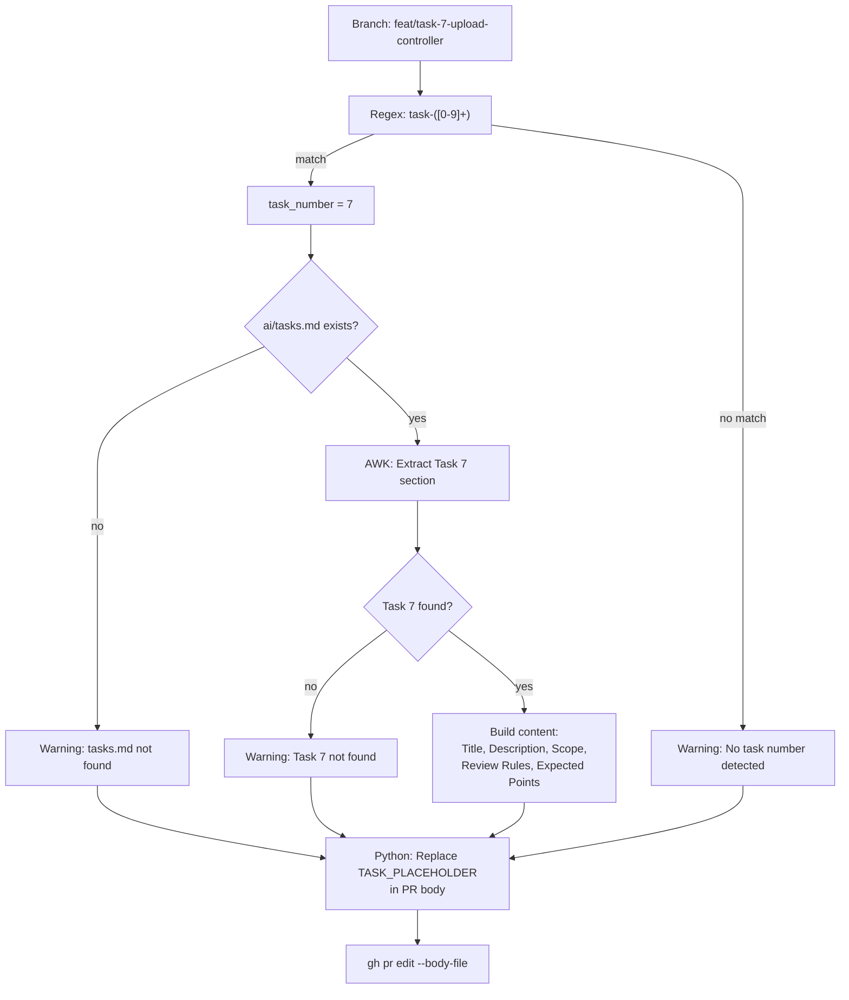
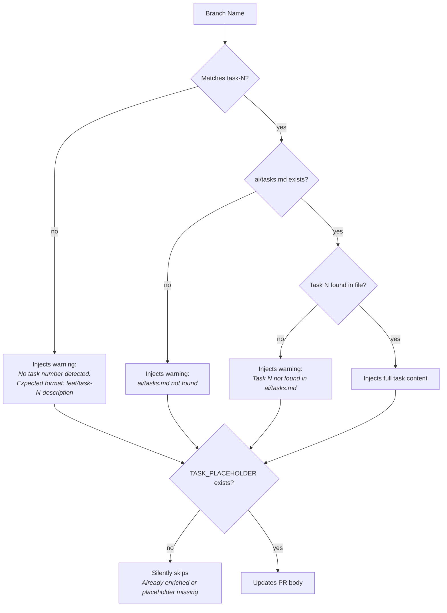

# PR Enrichment and Task Workflow

> The `enrich-description` job automatically extracts task context from `ai/tasks.md` and injects it into the PR body, giving Claude review the context it needs to evaluate the PR against expected review points.

---

## Table of Contents

- [Task-Based Development Philosophy](#task-based-development-philosophy)
- [Branch Naming Convention](#branch-naming-convention)
- [The ai/tasks.md File](#the-aitasksmd-file)
- [Enrich-Description Job Step by Step](#enrich-description-job-step-by-step)
- [The PR Template](#the-pr-template)
- [Edge Cases and Graceful Degradation](#edge-cases-and-graceful-degradation)
- [Related Pages](#related-pages)

---

## Task-Based Development Philosophy

Every feature in this project starts as a numbered task in `ai/tasks.md`. The task defines:

- **Description** — what needs to be built
- **Scope** — which files will be created or modified
- **Claude review rules** — which CLAUDE.md review sections apply
- **Expected review points** — what Claude should catch during review

This creates a feedback loop: the task defines what Claude should find, and after review, the PR template includes a "Review Evaluation" section to assess whether Claude actually found those things.

---

## Branch Naming Convention

**Required format:**

```
feat/task-{N}-{short-description}
chore/task-{N}-{description}
```

**Examples:**
- `feat/task-5-data-models` → task number `5`
- `chore/task-11-pr-enrich` → task number `11`
- `feat/task-7-upload-controller` → task number `7`

The regex used for extraction is `task-([0-9]+)` — it matches the first occurrence of `task-` followed by digits.

**Branches that don't match** (e.g., `feat/PROJ-1234-description`) will trigger a warning in the PR body instead of task content.

---

## The ai/tasks.md File

Each task in `ai/tasks.md` follows this markdown structure:

```markdown
### Task {N}: {Title} [optional ✅ COMPLETED]

**Description:** One-sentence summary of the task.

**Scope:**
- New: `path/to/NewFile.java`
- Modified: `path/to/ExistingFile.java`

**Claude review:** **CLAUDE.md {Section Name}**

**Expected review points:**
- [ ] First thing Claude should catch
- [ ] Second thing Claude should catch

**Size:** S/M/L
```

The enrichment job extracts: title, description, scope, Claude review section, and expected review points.

---

## Enrich-Description Job Step by Step



### Step 1: Extract Task Number

```yaml
- name: Extract task number from branch name
  id: extract
  run: |
    BRANCH="${{ github.head_ref }}"
    if [[ "$BRANCH" =~ task-([0-9]+) ]]; then
      echo "task_number=${BASH_REMATCH[1]}" >> "$GITHUB_OUTPUT"
    fi
```

The branch name (e.g., `feat/task-7-upload-controller`) is matched against the regex. The captured group becomes the task number.

### Step 2: Parse Task Content

The job uses `awk` to extract the task section from `ai/tasks.md`:

```bash
SECTION=$(awk '
  /^### Task '"$TASK_NUM"':/ { found=1; next }
  found && /^### Task [0-9]+:/ { found=0 }
  found && /^---$/ { found=0 }
  found && /^## / { found=0 }
  found { print }
' "$TASKS_FILE")
```

**How it works:**
1. Start capturing when `### Task {N}:` is found
2. Stop at the next task header, `---` separator, or `##` section header
3. Everything in between is the task content

Individual fields are then extracted with targeted `grep` and `awk` commands:
- **Title** — `grep -oP "^### Task ${N}: \K.*"` (removes `✅ COMPLETED` suffix)
- **Description** — Content after `**Description:**` until next `**` marker
- **Scope** — Bullet points under `**Scope:**`
- **Review rules** — Content after `**Claude review:**`
- **Expected points** — Checkbox items under `**Expected review points:**`

### Step 3: Build Task Content

The extracted fields are assembled into a markdown block and written to a temp file (`/tmp/task_content.md`).

### Step 4: Update PR Description

```python
python3 -c "
with open('/tmp/current_body.md', 'r') as f:
    body = f.read()
with open('/tmp/task_content.md', 'r') as f:
    replacement = f.read()
placeholder = '<!-- TASK_PLACEHOLDER -->'
if placeholder in body:
    body = body.replace(placeholder, replacement)
    with open('/tmp/new_body.md', 'w') as f:
        f.write(body)
"
```

**Why Python instead of bash `sed`?** The task content contains markdown with special characters (`*`, `[`, `]`, backticks, etc.) that would require complex escaping in bash. Python's `str.replace()` handles this safely.

The updated body is applied with `gh pr edit --body-file /tmp/new_body.md`.

---

## The PR Template

The file `.github/pull_request_template.md` defines the structure that every PR body starts with:

### Sections

| Section | Purpose |
|---------|---------|
| **Description** | Manual summary of changes (filled by developer) |
| **Task Reference** | Auto-populated by enrichment job (contains `<!-- TASK_PLACEHOLDER -->`) |
| **Type of Change** | Checkbox: feat, fix, refactor, docs, chore |
| **Review Rule Sets** | Checkbox: which CLAUDE.md path-specific rules apply |
| **Expected Review Findings** | What Claude should catch (copied from task) |
| **Testing** | Checklist: checkstyle, tests, new tests added |
| **Review Evaluation** | Filled AFTER Claude review — quality assessment |

### Review Evaluation Section

After Claude completes its review, the developer fills in:

| Metric | Value |
|--------|-------|
| Expected findings detected | 3/4 |
| False positives | 1 |
| Missed findings | 1 |
| Unexpected valuable findings | 2 |

This creates a structured record of Claude's review quality, which informs future CLAUDE.md rule improvements.

---

## Edge Cases and Graceful Degradation



**All edge cases are non-blocking.** The enrichment job never fails the pipeline — it either enriches the PR or injects a helpful warning. This ensures that:

- PRs from branches without task numbers still go through CI
- Missing `ai/tasks.md` doesn't break the pipeline
- Re-running enrichment on an already-enriched PR is safe (idempotent)

---

## Related Pages

- [CI Pipeline Deep Dive](03-CI-Pipeline-Deep-Dive) — Where enrich-description fits in the pipeline
- [Claude Code Review Job](05-Claude-Code-Review-Job) — How the review job uses the enriched PR description

---

*Last updated: 2026-02-19*

*Sources: `.github/workflows/ci.yml` (lines 8–135), `.github/pull_request_template.md`, `ai/tasks.md`*
