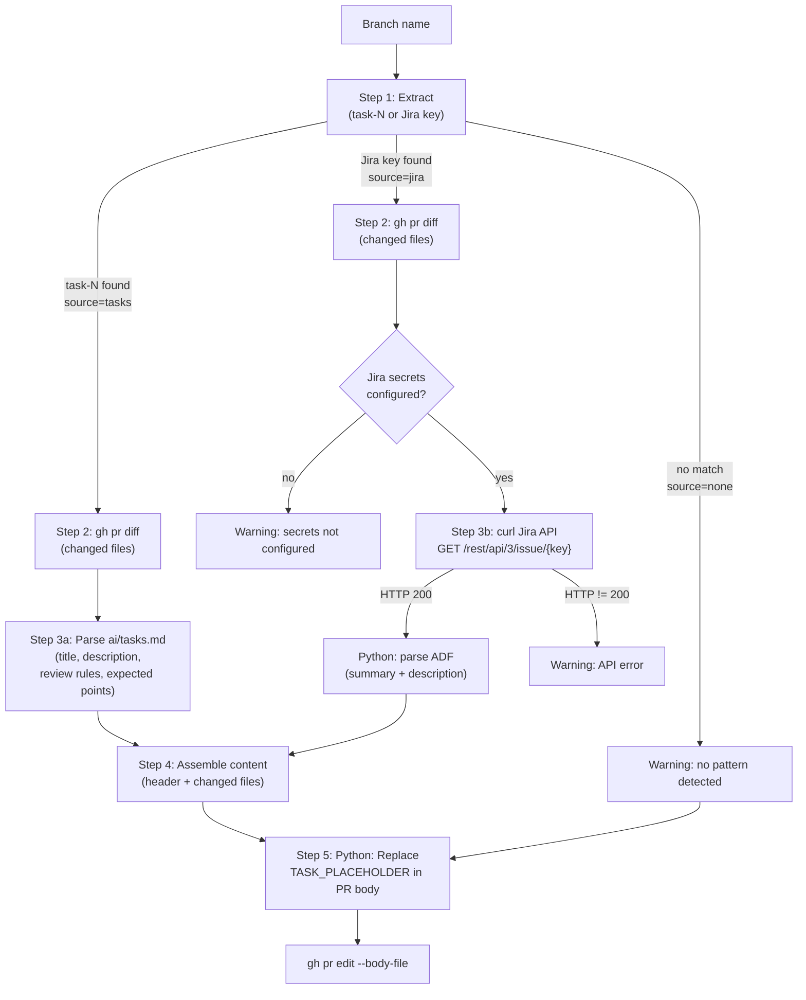

# PR Enrichment and Task Workflow

> The `enrich-description` job automatically enriches PR descriptions with context from two sources: `ai/tasks.md` (for task-based branches) or Jira REST API (for Jira ticket branches). It also appends the actual changed files from the PR diff, giving Claude review the context it needs.

---

## Table of Contents

- [Task-Based Development Philosophy](#task-based-development-philosophy)
- [Branch Naming Convention](#branch-naming-convention)
- [Data Sources](#data-sources)
- [Enrich-Description Job Step by Step](#enrich-description-job-step-by-step)
- [The PR Template](#the-pr-template)
- [Edge Cases and Graceful Degradation](#edge-cases-and-graceful-degradation)
- [Related Pages](#related-pages)

---

## Task-Based Development Philosophy

Every feature in this project starts as a numbered task in `ai/tasks.md`. The task defines:

- **Description** — what needs to be built
- **Claude review rules** — which CLAUDE.md review sections apply
- **Expected review points** — what Claude should catch during review

When working with Jira, the ticket provides the description and context. In both cases, the actual **changed files are taken from the PR diff** — not from any predefined list.

This creates a feedback loop: the task (or ticket) defines what Claude should find, and after review, the PR template includes a "Review Evaluation" section to assess whether Claude actually found those things.

---

## Branch Naming Convention

The enrichment job detects the data source from the branch name:

| Branch pattern | Source | Example |
|---|---|---|
| `feat/task-{N}-description` | `ai/tasks.md` | `feat/task-12-jira-integration` |
| `chore/task-{N}-description` | `ai/tasks.md` | `chore/task-3-checkstyle` |
| `feat/PROJ-1234-description` | Jira REST API | `feat/BM-5-upload-validation` |

**Priority:** `task-N` takes precedence. If a branch contains both patterns, `ai/tasks.md` is used.

**Regex patterns:**
- Task number: `task-([0-9]+)`
- Jira key: `([A-Z][A-Z0-9]*-[0-9]+)` (e.g., `BM-123`, `PROJ-1234`)

**Branches without either pattern** inject a warning into the PR body.

---

## Data Sources

### Source 1: ai/tasks.md

Each task in `ai/tasks.md` follows this structure:

```markdown
### Task {N}: {Title} [optional ✅ COMPLETED]

**Description:** One-sentence summary of the task.

**Claude review:** **CLAUDE.md {Section Name}**

**Expected review points:**
- [ ] First thing Claude should catch
- [ ] Second thing Claude should catch

**Size:** S/M/L
```

The enrichment job extracts: title, description, Claude review section, and expected review points. Changed files come from the PR diff.

### Source 2: Jira REST API

When a Jira key is detected, the job calls:

```
GET {JIRA_BASE_URL}/rest/api/3/issue/{issueKey}?fields=summary,description
```

Authentication uses Basic Auth with `JIRA_USER_EMAIL:JIRA_API_TOKEN`. The description is in ADF (Atlassian Document Format) and is parsed by a Python script into plain markdown.

Required GitHub repository secrets: `JIRA_BASE_URL`, `JIRA_USER_EMAIL`, `JIRA_API_TOKEN`.

---

## Enrich-Description Job Step by Step


```mermaid
graph TD
    START["Branch name"] --> EXTRACT["Step 1: Extract\n(task-N or Jira key)"]

    EXTRACT -->|"task-N found\nsource=tasks"| DIFF1["Step 2: gh pr diff\n(changed files)"]
    EXTRACT -->|"Jira key found\nsource=jira"| DIFF2["Step 2: gh pr diff\n(changed files)"]
    EXTRACT -->|"no match\nsource=none"| WARN0["Warning: no pattern detected"]

    DIFF1 --> TASKS["Step 3a: Parse ai/tasks.md\n(title, description,\nreview rules, expected points)"]
    DIFF2 --> JIRA_CHECK{"Jira secrets\nconfigured?"}

    JIRA_CHECK -->|"no"| WARN_SEC["Warning: secrets not configured"]
    JIRA_CHECK -->|"yes"| CURL["Step 3b: curl Jira API\nGET /rest/api/3/issue/{key}"]

    CURL -->|"HTTP 200"| PARSE["Python: parse ADF\n(summary + description)"]
    CURL -->|"HTTP != 200"| WARN_HTTP["Warning: API error"]

    TASKS --> BUILD["Step 4: Assemble content\n(header + changed files)"]
    PARSE --> BUILD

    BUILD --> REPLACE["Step 5: Python: Replace\nTASK_PLACEHOLDER in PR body"]
    WARN0 --> REPLACE
    REPLACE --> DONE["gh pr edit --body-file"]
```

### Step 1: Extract Source

```yaml
- name: Extract task number and Jira key from branch name
  id: extract
  run: |
    BRANCH="${{ github.head_ref }}"
    if [[ "$BRANCH" =~ task-([0-9]+) ]]; then
      echo "task_number=${BASH_REMATCH[1]}" >> "$GITHUB_OUTPUT"
      echo "source=tasks" >> "$GITHUB_OUTPUT"
    elif [[ "$BRANCH" =~ ([A-Z][A-Z0-9]*-[0-9]+) ]]; then
      echo "jira_key=${BASH_REMATCH[1]}" >> "$GITHUB_OUTPUT"
      echo "source=jira" >> "$GITHUB_OUTPUT"
    else
      echo "source=none" >> "$GITHUB_OUTPUT"
    fi
```

### Step 2: Get Changed Files

Both paths call `gh pr diff "$PR_NUM" --name-only` to get the list of actually modified files. This replaces the predefined `**Scope:**` lists from `ai/tasks.md` with real diff data.

### Step 3a: Parse ai/tasks.md (source=tasks)

The job uses `awk` to extract the task section:

```bash
SECTION=$(awk '
  /^### Task '"$TASK_NUM"':/ { found=1; next }
  found && /^### Task [0-9]+:/ { found=0 }
  found && /^---$/ { found=0 }
  found && /^## / { found=0 }
  found { print }
' "$TASKS_FILE")
```

Individual fields are extracted with targeted `grep` and `awk`:
- **Title** — `grep -oP "^### Task ${N}: \K.*"` (removes `✅ COMPLETED` suffix)
- **Description** — Content after `**Description:**` until next `**` marker
- **Review rules** — Content after `**Claude review:**`
- **Expected points** — Checkbox items under `**Expected review points:**`

### Step 3b: Fetch from Jira (source=jira)

```bash
HTTP_CODE=$(curl -s -o /tmp/jira_response.json -w "%{http_code}" \
  -u "$JIRA_USER_EMAIL:$JIRA_API_TOKEN" \
  "$JIRA_BASE_URL/rest/api/3/issue/$JIRA_KEY?fields=summary,description")
```

The curl response is stored in a temp file — credentials never appear in logs (GitHub Actions masks secrets automatically). A Python script parses the ADF description recursively and builds a markdown block.

### Step 4: Assemble Content

For both sources, the final content is:
```
### [Key](url): Title   ← Jira source
### Task N: Title        ← tasks.md source

**Description:** ...

**Changed files (from PR diff):**
- .github/workflows/ci.yml
- .github/pull_request_template.md

**Claude review:** ...      ← tasks.md source only
**Expected review points:**  ← tasks.md source only
```

### Step 5: Update PR Description

```python
python3 -c "
with open('/tmp/current_body.md', 'r') as f:
    body = f.read()
with open('/tmp/task_content.md', 'r') as f:
    replacement = f.read()
placeholder = '<!-- TASK_PLACEHOLDER -->'
if placeholder in body:
    body = body.replace(placeholder, replacement)
"
```

**Why Python instead of bash `sed`?** Markdown contains special characters (`*`, `[`, `]`, backticks) requiring complex escaping in bash. Python's `str.replace()` handles this safely.

---

## The PR Template

The file `.github/pull_request_template.md` defines the structure that every PR body starts with:

### Sections

| Section | Purpose |
|---------|---------|
| **Description** | Manual summary of changes (filled by developer) |
| **Task / Issue Reference** | Auto-populated: task from tasks.md, or Jira ticket data + PR diff |
| **Type of Change** | Checkbox: feat, fix, refactor, docs, chore |
| **Review Rule Sets** | Checkbox: which CLAUDE.md path-specific rules apply |
| **Expected Review Findings** | What Claude should catch (copied from task) |
| **Testing** | Checklist: checkstyle, tests, new tests added |
| **Review Evaluation** | Filled AFTER Claude review — quality assessment |

### Review Evaluation Section

After Claude completes its review, the developer fills in:

| Metric | Value |
|--------|-------|
| Expected findings detected | 3/4 |
| False positives | 1 |
| Missed findings | 1 |
| Unexpected valuable findings | 2 |

This creates a structured record of Claude's review quality, which informs future CLAUDE.md rule improvements.

---

## Edge Cases and Graceful Degradation

All edge cases are non-blocking. The enrichment job never fails the pipeline.

| Scenario | Behavior |
|---|---|
| Branch has no `task-N` or Jira key | Warning injected into PR body |
| `ai/tasks.md` not found | Warning injected |
| Task N not found in tasks.md | Warning injected |
| Jira secrets not configured | `::warning::` in CI logs, placeholder left unchanged |
| Jira API returns non-200 | `::warning::` in CI logs, placeholder left unchanged |
| Python ADF parser fails | `::warning::` in CI logs, placeholder left unchanged |
| `TASK_PLACEHOLDER` missing from PR body | Silently skipped (already enriched or manually filled) |

**Re-running is safe (idempotent):** If the placeholder is already replaced, the update step skips silently.

---

## Related Pages

- [CI Pipeline Deep Dive](03-CI-Pipeline-Deep-Dive) — Where enrich-description fits in the pipeline
- [Claude Code Review Job](05-Claude-Code-Review-Job) — How the review job uses the enriched PR description
- [Jira Integration Setup](14-Jira-Integration-Setup) — How to configure Jira credentials and GitHub secrets
- [Security and Permissions](09-Security-and-Permissions) — How Jira secrets are scoped in CI workflows

---

*Last updated: 2026-03-01*

*Sources: `.github/workflows/ci.yml` (enrich-description job), `.github/pull_request_template.md`, `ai/tasks.md`*
