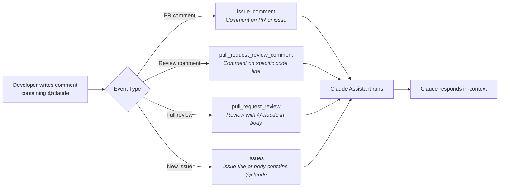

# Interactive Claude Assistant

> The `claude.yml` workflow turns Claude into an on-demand assistant — mention `@claude` in any PR comment, review, or issue to get analysis, code suggestions, or direct changes.

---

## Table of Contents

- [What is the Interactive Claude Assistant?](#what-is-the-interactive-claude-assistant)
- [How to Trigger](#how-to-trigger)
- [Supported Event Types](#supported-event-types)
- [Allowed Tools and Capabilities](#allowed-tools-and-capabilities)
- [What Claude Can and Cannot Do](#what-claude-can-and-cannot-do)
- [Use Cases](#use-cases)
- [Differences from Automated CI Review](#differences-from-automated-ci-review)
- [Related Pages](#related-pages)

---

## What is the Interactive Claude Assistant?

Unlike the automated CI review (which runs on every PR), the Interactive Claude Assistant is **human-initiated**. A developer writes a comment containing `@claude` and Claude responds in context — on the same PR, review thread, or issue.

This workflow is defined in `.github/workflows/claude.yml` and uses the same `anthropics/claude-code-action@v1` action, but with broader tool access and no structured reporting.

---

## How to Trigger

Mention `@claude` in any of these contexts:



**Examples of triggering comments:**
- `@claude Can you explain what this function does?`
- `@claude Please add error handling for the null case here`
- `@claude Run checkstyle and fix any violations`
- `@claude What does the upload validation flow look like?`

---

## Supported Event Types

```yaml
on:
  issue_comment:
    types: [created]
  pull_request_review_comment:
    types: [created]
  pull_request_review:
    types: [submitted]
  issues:
    types: [opened, assigned]
```

| Event | Context | When |
|-------|---------|------|
| `issue_comment` | PR or issue comment | New comment created containing `@claude` |
| `pull_request_review_comment` | Review comment on specific line | New inline review comment containing `@claude` |
| `pull_request_review` | Full PR review | Review submitted with `@claude` in the body |
| `issues` | Issue | New issue opened or assigned with `@claude` in title/body |

**Filtering condition:**

```yaml
if: |
  (github.event_name == 'issue_comment' && contains(github.event.comment.body, '@claude')) ||
  (github.event_name == 'pull_request_review_comment' && contains(github.event.comment.body, '@claude')) ||
  (github.event_name == 'pull_request_review' && contains(github.event.review.body, '@claude')) ||
  (github.event_name == 'issues' && (contains(github.event.issue.body, '@claude') || contains(github.event.issue.title, '@claude')))
```

Comments that don't contain `@claude` are ignored — the workflow won't trigger.

---

## Allowed Tools and Capabilities

The workflow uses a scoped `--allowedTools` whitelist:

```yaml
claude_args: |
  --allowedTools "Read,Write,Edit,
                  Bash(gh pr view:*),Bash(gh pr diff:*),Bash(gh pr comment:*),
                  Bash(gh issue view:*),Bash(gh issue comment:*),
                  Bash(git diff:*),Bash(git log:*),Bash(git status),
                  Bash(./mvnw checkstyle:check),Bash(./mvnw test),Bash(./mvnw test -Dtest:*),
                  mcp__github_inline_comment__create_inline_comment"
```

| Category | Tools | Purpose |
|----------|-------|---------|
| **File operations** | `Read`, `Write`, `Edit` | Read, create, and modify source files |
| **GitHub PR** | `gh pr view/diff/comment` | Read PR context and post comments |
| **GitHub Issues** | `gh issue view/comment` | Read issues and post comments |
| **Git** | `git diff/log/status` | Read git history and changes (read-only) |
| **Build** | `./mvnw checkstyle:check`, `./mvnw test` | Run checkstyle and tests on demand |
| **Inline comments** | `mcp__github_inline_comment__*` | Post inline comments on specific PR lines |

---

## What Claude Can and Cannot Do

| Action | Allowed? |
|--------|----------|
| Read any file in the repository | Yes |
| Create new files | Yes |
| Edit existing files | Yes |
| Run Checkstyle | Yes |
| Run tests (all or specific) | Yes |
| Post PR/issue comments | Yes |
| Read PR diff and git history | Yes |
| Push commits | No |
| Run arbitrary bash commands | No |
| Install packages | No |
| Access external APIs | No |
| Modify workflow files | No |

**Key difference from CI review:** The interactive assistant has `Read`, `Write`, and `Edit` access — it can modify source code. The CI review job cannot.

---

## Use Cases

### Asking for Explanations

> `@claude Can you explain the retry logic in BillAnalysisServiceImpl?`

Claude reads the file and explains the code in context.

### Requesting Code Changes

> `@claude Please add a null check for the file parameter in validateFile()`

Claude reads the current code, makes the change using the `Edit` tool, and responds with what was modified.

### Running Quality Checks

> `@claude Run checkstyle and let me know if there are any violations`

Claude executes `./mvnw checkstyle:check` and reports the results.

### Running Tests

> `@claude Run the tests for FileValidationServiceImplTest and show me the output`

Claude runs `./mvnw test -Dtest=FileValidationServiceImplTest` and summarizes results.

---

## Differences from Automated CI Review

| Aspect | CI Review (`ci.yml`) | Interactive (`claude.yml`) |
|--------|---------------------|---------------------------|
| **Trigger** | Automatic on every PR event | Manual (`@claude` mention) |
| **Can modify code?** | No (report only) | Yes (Read/Write/Edit) |
| **Produces artifact?** | Yes (structured report) | No |
| **Produces inline comments?** | Yes (automated) | Yes (on request) |
| **Can run tests?** | No (separate CI job) | Yes (`./mvnw test`) |
| **Follows structured review process?** | Yes (4-step workflow) | No (responds to request) |
| **Checkout depth** | Full history (`fetch-depth: 0`) | Shallow (`fetch-depth: 1`) |
| **Permissions** | `contents: read` | `contents: write` |

---

## Related Pages

- [Pipeline Overview](02-Pipeline-Overview) — How all three workflows compare
- [CLAUDE.MD as Review Brain](04-CLAUDE-MD-as-Review-Brain) — Review rules that Claude follows (also applies here)
- [Security and Permissions](09-Security-and-Permissions) — Tool restrictions across all workflows

---

*Last updated: 2026-02-19*

*Sources: `.github/workflows/claude.yml`, `docs/claude-actions-context.md`*
