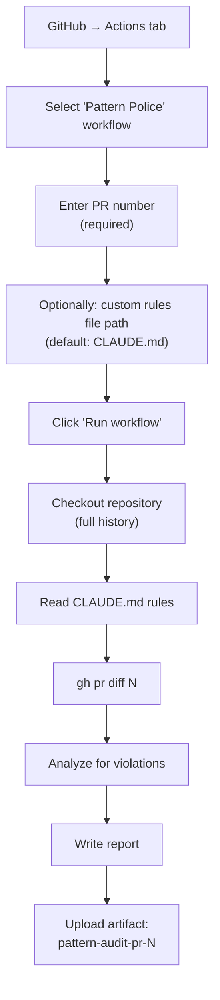

# Pattern Police

> The Pattern Police workflow is an on-demand architecture drift checker — manually triggered to verify that PR changes respect package boundaries, dependency directions, and code conventions defined in CLAUDE.md.

---

## Table of Contents

- [What is Pattern Police?](#what-is-pattern-police)
- [When to Use It](#when-to-use-it)
- [How to Trigger](#how-to-trigger)
- [Input Parameters](#input-parameters)
- [What It Checks](#what-it-checks)
- [Report Format and Severity Levels](#report-format-and-severity-levels)
- [Downloading the Report](#downloading-the-report)
- [Differences from Automated CI Review](#differences-from-automated-ci-review)
- [Related Pages](#related-pages)

---

## What is Pattern Police?

Pattern Police is a **manual workflow** (`workflow_dispatch`) defined in `.github/workflows/pattern-police.yml`. Given a PR number, it:

1. Reads the architecture rules from CLAUDE.md (or a custom rules file)
2. Fetches the PR diff
3. Analyzes every changed file for architecture violations
4. Produces a compliance report with severity ratings
5. Uploads the report as a downloadable artifact

Unlike the automated CI review (which runs on every PR), Pattern Police is triggered intentionally when you want a focused architecture audit.

---

## When to Use It

Pattern Police is most valuable when:

- A PR touches **multiple modules** (e.g., changes in both `upload/` and `config/`)
- You suspect **package boundary violations** (e.g., controller importing `ai/` internals)
- A PR involves **architectural decisions** (new abstractions, dependency changes)
- You want a **second opinion** beyond the automated CI review
- The PR is large and you want to verify **convention compliance** before merging

---

## How to Trigger



**Steps:**

1. Go to the **Actions** tab on GitHub
2. Select **Pattern Police** from the workflow list
3. Click **Run workflow**
4. Enter the **PR number** (required)
5. Optionally specify a **custom rules file** (defaults to `CLAUDE.md`)
6. Click the green **Run workflow** button

---

## Input Parameters

```yaml
on:
  workflow_dispatch:
    inputs:
      pr_number:
        description: PR number to analyze for architecture drift
        required: true
      rules_path:
        description: Path to architecture rules file
        required: false
        default: "CLAUDE.md"
```

| Parameter | Required | Default | Description |
|-----------|----------|---------|-------------|
| `pr_number` | Yes | — | The PR number to analyze (e.g., `7`) |
| `rules_path` | No | `CLAUDE.md` | Path to the file containing architecture rules |

---

## What It Checks

The prompt instructs Claude to extract rules from CLAUDE.md and check for:

### Package Boundary Violations

- Controller importing directly from `ai/` internals (should go through interfaces)
- Cross-module dependencies that bypass the service layer

### Dependency Direction Rules

- Concrete implementations used instead of interfaces
- Violations of Dependency Inversion Principle

### Code Convention Compliance

| Convention | What It Checks |
|-----------|---------------|
| `final` modifier | Parameters, fields, and catch variables must be `final` (except interface methods) |
| Java Records | DTOs must use Records, not classes with getters/setters |
| Interface patterns | Services should define interfaces, controllers depend on abstractions |

### Module-Specific Rules

| Module | Violations Checked |
|--------|-------------------|
| **Config** (`**/config/**`) | Hardcoded secrets, missing environment separation, non-configurable URLs |
| **Upload** (`**/upload/**`) | MIME validation by extension (should be magic bytes), missing size checks |
| **AI** (`**/ai/**`) | Missing timeout/retry configuration, raw API errors exposed to users |

---

## Report Format and Severity Levels

The report is written to `reports/pattern-drift-pr-{N}.md` and contains:

### 1. Summary of Enforced Rules

Brief listing of which rules were checked and from which source file.

### 2. Concrete Findings

Each finding includes:
- **File path** and **line reference**
- **Description** of the violation
- **Severity** rating

### 3. Severity Levels

| Level | Meaning |
|-------|---------|
| **Critical** | Architecture violation that must be fixed before merge (e.g., hardcoded secret, broken package boundary) |
| **Warning** | Convention violation that should be fixed (e.g., missing `final`, class used instead of Record) |
| **Info** | Suggestion for improvement, not blocking (e.g., could benefit from interface extraction) |

### 4. Suggested Patches

Minimal code changes as unified diff blocks to fix each finding.

### 5. Overall Compliance Score

| Score | Meaning |
|-------|---------|
| **Pass** | No critical findings, minor warnings only |
| **Needs Attention** | Warnings that should be addressed |
| **Fail** | Critical violations found |

---

## Downloading the Report

The report is uploaded as a GitHub Actions artifact named `pattern-audit-pr-{N}`:

```yaml
- name: Upload reports artifact
  if: ${{ hashFiles('reports/**') != '' }}
  uses: actions/upload-artifact@v4
  with:
    name: pattern-audit-pr-${{ inputs.pr_number }}
    path: reports/**
```

**To download:** Go to Actions → Pattern Police run → Artifacts section → Download `pattern-audit-pr-{N}`

---

## Differences from Automated CI Review

| Aspect | CI Review | Pattern Police |
|--------|----------|----------------|
| **Trigger** | Automatic (every PR) | Manual (workflow_dispatch) |
| **Focus** | Broad code review (logic, security, API design) | Architecture compliance only |
| **Output** | Inline comments + PR summary + report | Report only (no inline comments) |
| **Permissions** | `pull-requests: write` | `pull-requests: read` (read-only) |
| **Can post comments?** | Yes | No |
| **Severity ratings?** | No (narrative review) | Yes (critical/warning/info) |
| **Compliance score?** | No | Yes (pass/needs attention/fail) |
| **Allowed tools** | `Write`, `gh pr comment/diff/view`, inline comments | `Write`, `gh pr diff/view`, `mkdir` |

---

## Related Pages

- [Pipeline Overview](02-Pipeline-Overview) — How Pattern Police fits alongside CI and Interactive workflows
- [CLAUDE.MD as Review Brain](04-CLAUDE-MD-as-Review-Brain) — The rules that Pattern Police enforces
- [Security and Permissions](09-Security-and-Permissions) — Minimal permissions for audit-only access

---

*Last updated: 2026-02-19*

*Sources: `.github/workflows/pattern-police.yml`, `CLAUDE.md` (Path-Specific Review Rules)*
