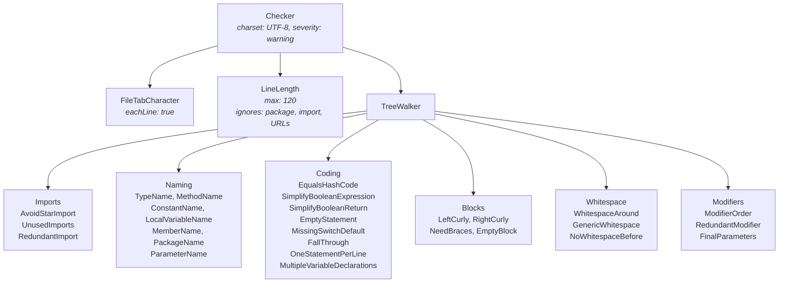

# Checkstyle Configuration

> Checkstyle enforces Google Java Style as the first quality gate in the CI pipeline — if formatting fails, tests and Claude review never run.

---

## Table of Contents

- [Role in the Pipeline](#role-in-the-pipeline)
- [Configuration File](#configuration-file)
- [Module Categories and Active Rules](#module-categories-and-active-rules)
- [The FinalParameters and RedundantModifier Interaction](#the-finalparameters-and-redundantmodifier-interaction)
- [Running Checkstyle Locally](#running-checkstyle-locally)
- [Maven Plugin Configuration](#maven-plugin-configuration)
- [Why Claude Skips Formatting Issues](#why-claude-skips-formatting-issues)
- [Related Pages](#related-pages)

---

## Role in the Pipeline

Checkstyle is the **2nd job** in the CI pipeline, running immediately after PR description enrichment:

```
enrich-description → checkstyle → test → claude-review → cleanup-label
```

**It's a blocking gate:** if any Checkstyle violation is detected, the pipeline stops. Unit tests won't run, and Claude won't review the code. This ensures:

1. Consistent code style across all PRs
2. No wasted CI time on poorly formatted code
3. Claude focuses on semantic issues, not style

---

## Configuration File

The Checkstyle configuration lives at `checkstyle.xml` in the repository root. It's based on Google Java Style with project-specific additions.



---

## Module Categories and Active Rules

### File-Level Checks

| Module | Rule | Notes |
|--------|------|-------|
| `FileTabCharacter` | No tab characters | Checked per line |
| `LineLength` | Max 120 characters | Ignores `package`, `import`, and URL lines |

### Import Checks

| Module | Rule |
|--------|------|
| `AvoidStarImport` | No wildcard imports (`import java.util.*`) |
| `UnusedImports` | No unused import statements |
| `RedundantImport` | No duplicate or `java.lang.*` imports |

### Naming Conventions

| Module | Applies To | Pattern |
|--------|-----------|---------|
| `TypeName` | Classes, interfaces, enums | `^[A-Z][a-zA-Z0-9]*$` |
| `MethodName` | Methods | `^[a-z][a-zA-Z0-9]*$` |
| `ConstantName` | `static final` fields | `^[A-Z][A-Z0-9]*(_[A-Z0-9]+)*$` |
| `LocalVariableName` | Local variables | `^[a-z][a-zA-Z0-9]*$` |
| `MemberName` | Instance fields | `^[a-z][a-zA-Z0-9]*$` |
| `PackageName` | Packages | `^[a-z]+(\.[a-z][a-z0-9]*)*$` |
| `ParameterName` | Method parameters | `^[a-z][a-zA-Z0-9]*$` |

### Coding Rules

| Module | What It Catches |
|--------|----------------|
| `EqualsHashCode` | `equals()` without `hashCode()` or vice versa |
| `SimplifyBooleanExpression` | `if (b == true)` → `if (b)` |
| `SimplifyBooleanReturn` | `if (cond) return true; else return false;` → `return cond;` |
| `EmptyStatement` | Stray semicolons (`;`) |
| `MissingSwitchDefault` | `switch` without `default` case |
| `FallThrough` | `case` without `break` or `return` |
| `OneStatementPerLine` | Multiple statements on one line |
| `MultipleVariableDeclarations` | `int a, b, c;` on one line |

### Block Checks

| Module | Rule |
|--------|------|
| `LeftCurly` | Opening brace on same line (K&R style) |
| `RightCurly` | Closing brace alone on its line |
| `NeedBraces` | All control structures require braces (`if`, `for`, `while`) |
| `EmptyBlock` | No empty blocks (`{}`) |

### Whitespace

| Module | Rule | Notes |
|--------|------|-------|
| `WhitespaceAround` | Spaces around operators and keywords | Allows empty constructors, methods, types, loops |
| `GenericWhitespace` | Proper spacing in generics (`List<String>`) |
| `NoWhitespaceBefore` | No space before `;` and `,` |

### Modifiers

| Module | Rule |
|--------|------|
| `ModifierOrder` | Modifiers in standard order (`public static final`) |
| `RedundantModifier` | No redundant modifiers (e.g., `public` on interface methods) |
| `FinalParameters` | All method parameters, constructor parameters, and catch variables must be `final` |

---

## The FinalParameters and RedundantModifier Interaction

The project enforces `final` on all parameters via the `FinalParameters` module. However, this creates a conflict with `RedundantModifier` for **interface method parameters**.

**The problem:**

```java
// Interface declaration
public interface FileValidationService {
    void validateFile(final MultipartFile file);  // RedundantModifier violation!
}
```

Checkstyle's `RedundantModifier` module considers `final` on interface method parameters as redundant (since interface methods don't have bodies, `final` has no effect).

**The solution:**

The project convention (documented in CLAUDE.md) is:

- Use `final` on all parameters in **concrete classes** (constructor params, method params, catch variables)
- Do **NOT** use `final` on parameters in **interface method signatures**

```java
// Interface — no final
public interface FileValidationService {
    void validateFile(MultipartFile file);
}

// Implementation — final required
public class FileValidationServiceImpl implements FileValidationService {
    @Override
    public void validateFile(final MultipartFile file) { ... }
}
```

---

## Running Checkstyle Locally

Always run Checkstyle before committing to avoid CI failures:

```bash
# Run checkstyle
./mvnw checkstyle:check

# If violations found, fix them, then re-run
./mvnw checkstyle:check

# Only commit when checkstyle passes (0 violations)
```

**IDE integration:** Most Java IDEs (IntelliJ IDEA, Eclipse) support Checkstyle plugins that show violations in real-time.

---

## Maven Plugin Configuration

The Checkstyle Maven plugin is configured in `pom.xml`:

```xml
<plugin>
    <groupId>org.apache.maven.plugins</groupId>
    <artifactId>maven-checkstyle-plugin</artifactId>
    <version>3.6.0</version>
    <configuration>
        <configLocation>checkstyle.xml</configLocation>
        <consoleOutput>true</consoleOutput>
        <failsOnError>true</failsOnError>
        <violationSeverity>warning</violationSeverity>
    </configuration>
    <dependencies>
        <dependency>
            <groupId>com.puppycrawl.tools</groupId>
            <artifactId>checkstyle</artifactId>
            <version>10.23.1</version>
        </dependency>
    </dependencies>
</plugin>
```

| Setting | Value | Meaning |
|---------|-------|---------|
| `configLocation` | `checkstyle.xml` | Points to the config file in repo root |
| `consoleOutput` | `true` | Print violations to console |
| `failsOnError` | `true` | Fail the build on violations |
| `violationSeverity` | `warning` | Treat warnings as failures |
| Checkstyle version | `10.23.1` | Explicit version (not inherited from parent) |

---

## Relationship with Spotless

The project uses both Spotless (`google-java-format`) and Checkstyle:

| Tool | What It Handles | Auto-fixable? |
|------|----------------|---------------|
| **Spotless** | Indentation, line wrapping, import ordering, whitespace formatting | Yes (`./mvnw spotless:apply`) |
| **Checkstyle** | Code rules requiring manual fixes (`FinalParameters`, naming conventions, `EqualsHashCode`, etc.) | No |

Both run in CI within the same job: Spotless first, then Checkstyle. They are complementary, not competing — Spotless handles the auto-fixable formatting concerns, while Checkstyle enforces structural code rules.

**Developer workflow:** Run `./mvnw spotless:apply` before committing to auto-fix formatting, then verify with `./mvnw checkstyle:check`.

---

## Why Claude Skips Formatting Issues

The CI pipeline explicitly tells Claude to skip formatting:

```
DO NOT comment on formatting issues (handled by Spotless + Checkstyle CI job).
```

**Rationale:**

1. **Deterministic vs. semantic:** Spotless and Checkstyle produce deterministic pass/fail results for style rules. Claude adds value where automated tools fall short — understanding code logic and intent.
2. **Efficiency:** Claude's review cycles are expensive. Spending them on "add a space before `{`" wastes capacity that should go to "this null check is missing" or "this API key could be exposed."
3. **No duplication:** If Spotless/Checkstyle already catches a formatting issue, Claude mentioning it again adds noise, not value.
4. **Pipeline ordering:** By running Spotless and Checkstyle *before* Claude review, the pipeline ensures Claude only sees code that already meets style standards.

---

## Related Pages

- [CI Pipeline Deep Dive](03-CI-Pipeline-Deep-Dive) — Where the checkstyle job fits in the pipeline
- [CLAUDE.MD as Review Brain](04-CLAUDE-MD-as-Review-Brain) — How the DO/DON'T review split works

---

*Last updated: 2026-02-20*

*Sources: `checkstyle.xml`, `pom.xml` (maven-checkstyle-plugin, spotless-maven-plugin), `CLAUDE.md` (Code Conventions — Use of `final`, Auto-formatting with Spotless)*
