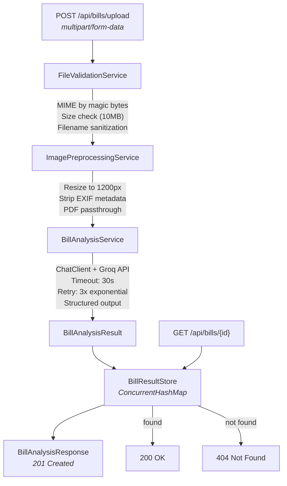

# Application Architecture

> Bill-Manager is a Spring Boot 3.5.x application for automated bill analysis using LLMs — but its primary purpose is serving as a testing ground for Claude Code Actions automated code review.

---

## Table of Contents

- [Application Purpose](#application-purpose)
- [Package Structure](#package-structure)
- [Application Flow](#application-flow)
- [REST API Endpoints](#rest-api-endpoints)
- [Data Models](#data-models)
- [Configuration Properties](#configuration-properties)
- [Technology Stack](#technology-stack)
- [Related Pages](#related-pages)

---

## Application Purpose

This project has a **dual purpose**:

1. **Functional POC** — A working Spring Boot application that accepts bill/receipt images, validates them, and sends them to an LLM (Groq) for analysis
2. **CI/CD Testing Ground** — The primary reason this project exists: to test and refine Claude Code Actions automated code review in real CI pipelines

The application is intentionally structured into distinct modules (`config/`, `upload/`, `ai/`, `dto/`, `exception/`) to exercise the **path-specific review rules** defined in [CLAUDE.MD](04-CLAUDE-MD-as-Review-Brain).

---

## Package Structure

```
com.example.bill_manager/
├── BillManagerApplication.java      # Spring Boot entry point
│
├── config/                          # Application configuration
│   ├── GroqApiProperties.java       # Timeout, retry, base-url, model
│   ├── UploadProperties.java        # Max file size, allowed MIME types
│   └── ApiKeyValidator.java         # Fail-fast startup validation
│
├── ai/                              # LLM integration (Groq via Spring AI)
│   ├── BillAnalysisService.java     # Interface
│   └── BillAnalysisServiceImpl.java # ChatClient, structured output, retry
│
├── upload/                          # Upload, validation, preprocessing
│   ├── BillUploadController.java    # REST endpoints (POST upload, GET by id)
│   ├── BillResultStore.java         # In-memory storage (ConcurrentHashMap)
│   ├── FileValidationService.java   # Interface
│   ├── FileValidationServiceImpl.java # MIME magic bytes, size, filename
│   ├── FileValidationException.java # Custom exception with ErrorCode enum
│   ├── ImagePreprocessingService.java    # Interface
│   └── ImagePreprocessingServiceImpl.java # Resize, EXIF strip
│
├── dto/                             # Data Transfer Objects (Java Records)
│   ├── BillAnalysisResult.java      # LLM response: merchant, items, total
│   ├── BillAnalysisResponse.java    # API response: id, filename, analysis
│   ├── LineItem.java                # Single item: name, qty, price
│   └── ErrorResponse.java          # Error: code, message, timestamp
│
└── exception/                       # Global error handling
    ├── GlobalExceptionHandler.java  # @ControllerAdvice for 9 exception types
    └── AnalysisNotFoundException.java
```

Each package maps to a path-specific review rule set in CLAUDE.md:
- `config/` → Config Module rules (secrets, env separation)
- `upload/` → Upload Module rules (MIME validation, path traversal)
- `ai/` → AI Module rules (timeout, retry, structured output)

---

## Application Flow



---

## REST API Endpoints

| Endpoint | Method | Description | Response |
|----------|--------|-------------|----------|
| `/api/bills/upload` | POST | Upload bill file, trigger AI analysis | 201 Created |
| `/api/bills/{id}` | GET | Retrieve analysis result by UUID | 200 OK / 404 |

### Error Responses

All errors return a standardized `ErrorResponse`:

```json
{
  "code": 415,
  "message": "Unsupported file type. Allowed: image/jpeg, image/png, application/pdf",
  "timestamp": "2026-02-19T10:30:00Z"
}
```

| HTTP Code | Scenario |
|-----------|----------|
| 400 | Missing or empty file |
| 404 | Analysis result not found |
| 413 | File exceeds 10MB limit |
| 415 | Unsupported MIME type |
| 500 | Internal server error |
| 503 | Groq API unavailable (after retries) |

---

## Data Models

All DTOs are implemented as **Java Records** (project convention):

### BillAnalysisResponse

```java
public record BillAnalysisResponse(
    UUID id,
    String originalFileName,
    BillAnalysisResult analysis,    // nullable until AI completes
    Instant analyzedAt
) {}
```

### BillAnalysisResult

```java
public record BillAnalysisResult(
    String merchantName,
    List<LineItem> items,
    BigDecimal totalAmount,
    String currency,
    List<String> categoryTags       // nullable (LLM may not return)
) {}
```

### LineItem

```java
public record LineItem(
    String name,
    @Positive int quantity,
    @PositiveOrZero BigDecimal unitPrice,
    @PositiveOrZero BigDecimal totalPrice
) {}
```

---

## Configuration Properties

### Application Properties (`application.properties`)

| Property | Default Value | Description |
|----------|--------------|-------------|
| `spring.ai.openai.api-key` | `${GROQ_API_KEY}` | Groq API key (from env var) |
| `spring.ai.openai.base-url` | `https://api.groq.com/openai/v1` | Groq endpoint |
| `spring.ai.openai.chat.options.model` | `llama-3.3-70b-versatile` | LLM model |
| `spring.ai.openai.chat.options.temperature` | `0.3` | Low temp for deterministic analysis |
| `groq.api.timeout-seconds` | `30` | API call timeout |
| `groq.api.retry.max-attempts` | `3` | Max retry count |
| `groq.api.retry.initial-delay-ms` | `1000` | Initial backoff delay |
| `groq.api.retry.multiplier` | `2.0` | Exponential backoff multiplier |
| `upload.max-file-size-bytes` | `10485760` (10MB) | App-level file size limit |
| `upload.allowed-mime-types` | `image/jpeg,image/png,application/pdf` | Allowed file types |
| `spring.servlet.multipart.max-file-size` | `11MB` | Servlet multipart limit (above app limit) |

### Development Profile (`application-dev.properties`)

| Override | Value | Reason |
|----------|-------|--------|
| `groq.api.timeout-seconds` | `60` | Longer timeout for dev |
| `groq.api.retry.max-attempts` | `5` | More retries for dev |
| `upload.max-file-size-bytes` | `20971520` (20MB) | Lenient for testing |
| `logging.level.*` | `DEBUG` | Verbose logging |

---

## Technology Stack

| Component | Technology | Version |
|-----------|-----------|---------|
| Runtime | Java | 17 (LTS) |
| Framework | Spring Boot | 3.5.10 |
| AI Integration | Spring AI (OpenAI starter) | 1.1.2 |
| LLM Provider | Groq (OpenAI-compatible) | — |
| Build | Maven (wrapper) | 3.9.12 |
| Linting | Checkstyle (Google Style) | 10.23.1 |
| Validation | Jakarta Bean Validation | — |
| Storage | ConcurrentHashMap (in-memory) | — |

For detailed technology decisions, see `ai/tech-stack.md` in the repository.

---

## Related Pages

- [CLAUDE.MD as Review Brain](04-CLAUDE-MD-as-Review-Brain) — Path-specific rules for each module
- [Checkstyle Configuration](10-Checkstyle-Configuration) — Code style enforcement
- [Contributing Guide](12-Contributing-Guide) — How to set up and develop locally

---

*Last updated: 2026-02-19*

*Sources: `ai/tech-stack.md`, `ai/api-plan.md`, `ai/prd.md`, source code tree*
