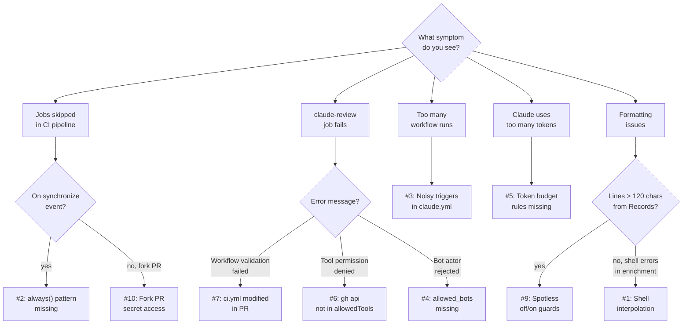

# Troubleshooting and Lessons Learned

> Every problem in this page was discovered during real CI pipeline runs — here are the symptoms, root causes, and fixes so you don't have to rediscover them.

---

## Table of Contents

- [Symptom Decision Tree](#symptom-decision-tree)
- [Quick-Reference Table](#quick-reference-table)
- [CI Pipeline Logic](#ci-pipeline-logic)
  - [Shell Interpolation in PR Enrichment](#shell-interpolation-in-pr-enrichment)
  - [Jobs Skipped on synchronize Event](#jobs-skipped-on-synchronize-event)
  - [Noisy Triggers Causing Redundant Runs](#noisy-triggers-causing-redundant-runs)
- [Claude Code Action Configuration](#claude-code-action-configuration)
  - [Bot-Initiated PR Events Rejected](#bot-initiated-pr-events-rejected)
  - [Token Overflow in Review](#token-overflow-in-review)
  - [Tool Permission Denials](#tool-permission-denials)
  - [Workflow File Validation Failure](#workflow-file-validation-failure)
  - [Missing Search Tools for Context](#missing-search-tools-for-context)
- [Build Tooling](#build-tooling)
  - [Spotless Formatting Guards for Records](#spotless-formatting-guards-for-records)
- [Security and Access Control](#security-and-access-control)
  - [Fork PR Secret Access](#fork-pr-secret-access)
- [Setup Checklist for New Projects](#setup-checklist-for-new-projects)
- [Related Pages](#related-pages)

---

## Symptom Decision Tree

Use this flowchart to quickly navigate from what you observe to the relevant solution:



---

## Quick-Reference Table

| # | Symptom | Category | One-Line Fix | Details |
|---|---------|----------|--------------|---------|
| 1 | PR enrichment fails with shell errors | CI Pipeline | Use temp files + Python for placeholder replacement | [Details](#shell-interpolation-in-pr-enrichment) |
| 2 | Test and review jobs skipped on code push | CI Pipeline | Add `always() && needs.X.result == 'success'` pattern | [Details](#jobs-skipped-on-synchronize-event) |
| 3 | ~14 redundant skipped workflow runs per cycle | CI Pipeline | Remove `pull_request_review*` triggers, add bot filter | [Details](#noisy-triggers-causing-redundant-runs) |
| 4 | Claude rejects PRs from bots (dependabot) | Claude Config | Add `allowed_bots: "claude[bot],github-actions[bot]"` | [Details](#bot-initiated-pr-events-rejected) |
| 5 | Claude review consumes excessive tokens | Claude Config | Add Token Budget Rules to prompt | [Details](#token-overflow-in-review) |
| 6 | Claude gets permission denied reading files | Claude Config | Explicit prompt guidance: "Use `Read` tool, not `gh api`" | [Details](#tool-permission-denials) |
| 7 | claude-review fails on PRs that modify ci.yml | Claude Config | Merge with `--admin`, document as expected | [Details](#workflow-file-validation-failure) |
| 8 | Claude cannot explore codebase beyond diff | Claude Config | Add `Glob` and `Grep` to `--allowedTools` | [Details](#missing-search-tools-for-context) |
| 9 | Spotless produces >120 char lines for Records | Build | Add `// spotless:off` / `// spotless:on` guards | [Details](#spotless-formatting-guards-for-records) |
| 10 | Claude review silently skips on fork PRs | Security | By design; only checkstyle and test run for forks | [Details](#fork-pr-secret-access) |

---

## CI Pipeline Logic

### Shell Interpolation in PR Enrichment

| Aspect | Detail |
|--------|--------|
| **Symptom** | `enrich-description` job fails with cryptic bash errors when writing markdown content |
| **Root Cause** | Bash interpreted markdown characters (`*`, `[`, backticks) in task content when using `GITHUB_OUTPUT` heredoc and `${{ }}` interpolation in `gh pr edit --body` |
| **Fix** | Write content to `/tmp/task_content.md` instead of `GITHUB_OUTPUT`. Use Python3 `str.replace()` for safe placeholder substitution. Apply with `gh pr edit --body-file` |
| **Commit** | `59935a7` |
| **See Also** | [PR Enrichment and Task Workflow](06-PR-Enrichment-and-Task-Workflow) |

**Before:** Content passed through `GITHUB_OUTPUT` heredoc and `${{ steps.parse.outputs.task_body }}` interpolation:

```yaml
# Dangerous: bash interprets markdown characters
UPDATED_BODY="${CURRENT_BODY//<!-- TASK_PLACEHOLDER -->/$TASK_CONTENT}"
gh pr edit "$PR_NUM" --body "$UPDATED_BODY"
```

**After:** Temp files + Python3 for safe replacement:

```yaml
- name: Update PR description
  run: |
    gh pr view "$PR_NUM" --json body --jq '.body' > /tmp/current_body.md
    python3 -c "
    with open('/tmp/current_body.md', 'r') as f:
        body = f.read()
    with open('/tmp/task_content.md', 'r') as f:
        replacement = f.read()
    if '<!-- TASK_PLACEHOLDER -->' in body:
        body = body.replace('<!-- TASK_PLACEHOLDER -->', replacement)
        with open('/tmp/new_body.md', 'w') as f:
            f.write(body)
    "
    gh pr edit "$PR_NUM" --body-file /tmp/new_body.md
```

**Lesson:** Never pass markdown content through bash string interpolation. Use temp files + a safe language (Python) for string operations in GitHub Actions.

---

### Jobs Skipped on synchronize Event

| Aspect | Detail |
|--------|--------|
| **Symptom** | When developer pushes code to a PR branch, `test` and `claude-review` jobs show as "Skipped" in GitHub Actions |
| **Root Cause** | GitHub Actions default behavior skips downstream jobs when a dependency is skipped. Since `enrich-description` is skipped on `synchronize` events, the entire chain was skipped |
| **Fix** | Add `always()` function to each job's `if` condition with explicit result checks |
| **Commit** | `527b506` |
| **See Also** | [CI Pipeline Deep Dive — The always() Pattern](03-CI-Pipeline-Deep-Dive#the-always-pattern-explained) |

**Before:** No conditional logic — GitHub auto-skips entire chain:

```yaml
test:
  needs: checkstyle
  runs-on: ubuntu-latest

claude-review:
  needs: test
  runs-on: ubuntu-latest
```

**After:** `always()` + explicit result check:

```yaml
checkstyle:
  needs: enrich-description
  if: always() && needs.enrich-description.result != 'failure'

test:
  needs: checkstyle
  if: always() && needs.checkstyle.result == 'success'

claude-review:
  needs: test
  if: always() && needs.test.result == 'success'
```

**Why two different conditions:**
- `checkstyle` uses `!= 'failure'` — must run when enrichment is skipped (`synchronize`) but stop when it fails
- `test` and `claude-review` use `== 'success'` — strict gate, upstream must explicitly pass

**Lesson:** Any GitHub Actions pipeline where a job can be legitimately skipped needs `always()` on all downstream jobs to prevent cascade skipping.

---

### Noisy Triggers Causing Redundant Runs

| Aspect | Detail |
|--------|--------|
| **Symptom** | Every Claude review cycle generates ~14 skipped `claude.yml` workflow runs in the Actions tab |
| **Root Cause** | `claude.yml` listened to `pull_request_review` and `pull_request_review_comment` events. Each inline comment from `claude[bot]` triggered a new workflow run |
| **Fix** | (1) Remove those triggers. (2) Add `!endsWith(github.actor, '[bot]')` guard |
| **Commit** | `efb4154` |
| **See Also** | [Interactive Claude Assistant](07-Interactive-Claude-Assistant), [Security and Permissions — Bot Actor Control](09-Security-and-Permissions#bot-actor-control) |

**Before:** Four triggers, including review events:

```yaml
on:
  issue_comment:
    types: [created]
  pull_request_review_comment:
    types: [created]
  pull_request_review:
    types: [submitted]
  issues:
    types: [opened, assigned]
```

**After:** Only two triggers + bot filter on job:

```yaml
on:
  issue_comment:
    types: [created]
  issues:
    types: [opened, assigned]
```

```yaml
jobs:
  claude:
    if: |
      !endsWith(github.actor, '[bot]') &&
      (
        (github.event_name == 'issue_comment' && contains(github.event.comment.body, '@claude')) ||
        (github.event_name == 'issues' && (contains(github.event.issue.body, '@claude') || contains(github.event.issue.title, '@claude')))
      )
```

**Lesson:** When one workflow (CI review) produces outputs that another workflow (interactive) listens to, you create a feedback loop. Solve by removing overlapping triggers and filtering bot actors.

---

## Claude Code Action Configuration

### Bot-Initiated PR Events Rejected

| Aspect | Detail |
|--------|--------|
| **Symptom** | Claude Code Action silently ignores PR events when the PR was created or modified by a bot (e.g., `dependabot`, `github-actions[bot]`) |
| **Root Cause** | By default, Claude Code Action only processes events from human actors |
| **Fix** | Add `allowed_bots` parameter to the action configuration |
| **Commit** | `56c2982` |
| **See Also** | [Security and Permissions — Bot Actor Control](09-Security-and-Permissions#bot-actor-control) |

```yaml
uses: anthropics/claude-code-action@v1
with:
  claude_code_oauth_token: ${{ secrets.CLAUDE_CODE_OAUTH_TOKEN }}
  allowed_bots: "claude[bot],github-actions[bot]"
```

**Lesson:** If your pipeline enriches PR descriptions (via `github-actions[bot]`), Claude Code Action needs explicit permission to process bot-generated events.

---

### Token Overflow in Review

| Aspect | Detail |
|--------|--------|
| **Symptom** | Claude review reads unnecessary files (README, wiki, build configs not in the diff), consuming excessive tokens and running out of turns before completing the review |
| **Root Cause** | Without explicit guidance, Claude's agentic loop reads many files to build context, even when the diff alone is sufficient |
| **Fix** | Add explicit Token Budget Rules to the review prompt |
| **Commit** | `72b479f` |
| **See Also** | [Claude Code Review Job — Token Budget Rules](05-Claude-Code-Review-Job#token-budget-rules) |

**Token Budget Rules added to prompt:**

```yaml
prompt: |
  ## Token Budget Rules (CRITICAL)
  - Use `gh pr diff` as your PRIMARY source of changes
  - Use `Read` tool for file contents — NEVER use `gh api` to read files
  - Use `Write` tool to create report files — it auto-creates directories, no `mkdir` needed
  - You MAY read related files (interfaces, parent classes, callers, test counterparts)
    when needed to verify correctness — keep it targeted (max 5 extra file reads)
  - Use `Grep`/`Glob` to find related code — this is cheaper than reading full files
  - Do NOT read unrelated files (README, wiki/, build configs not in the diff)
```

**Also removed:** `Bash(mkdir -p reports)` from `--allowedTools` (the `Write` tool auto-creates directories).

**Lesson:** LLM agents will explore broadly unless constrained. Always include explicit token/resource budget rules in review prompts.

---

### Tool Permission Denials

| Aspect | Detail |
|--------|--------|
| **Symptom** | Claude review fails mid-execution with tool permission denied errors |
| **Root Cause** | Claude used `gh api repos/.../contents/...` (Bash) to read file contents instead of the `Read` tool. `Bash(gh api:*)` was not in `--allowedTools` |
| **Fix** | (1) Add explicit prompt guidance. (2) Increase `--max-turns` from 15 to 20 for recovery room |
| **Commit** | `3927493` |
| **See Also** | [Claude Code Review Job — Tool Restrictions](05-Claude-Code-Review-Job#tool-restrictions) |

**Guidance added to prompt:**

```
- Use `Read` tool for file contents — NEVER use `gh api` to read files
- Use `Write` tool to create report files — it auto-creates directories, no `mkdir` needed
```

**max-turns increased:**

```yaml
# Before
claude_args: |
  --max-turns 15

# After
claude_args: |
  --max-turns 20
```

**Lesson:** Claude may find creative (but unauthorized) ways to accomplish tasks. Explicitly state which tools to use AND which to avoid. Increase `--max-turns` to give Claude room to recover from early missteps.

---

### Workflow File Validation Failure

| Aspect | Detail |
|--------|--------|
| **Symptom** | `claude-review` job fails with: "Workflow validation failed. The workflow file must exist and have identical content to the version on the repository's default branch." |
| **Root Cause** | Claude Code Action has a security feature that compares the invoking workflow file on the PR branch with the version on `master`. This prevents malicious PRs from tampering with the review workflow |
| **Fix** | This is by design, not a bug. Merge with `--admin` flag, subsequent PRs pass |
| **Commit** | `070ae2d` (documentation) |
| **See Also** | [CI Pipeline Deep Dive — Workflow File Validation](03-CI-Pipeline-Deep-Dive#workflow-file-validation-expected-failure), [Security and Permissions — Workflow File Validation](09-Security-and-Permissions#workflow-file-validation) |

**Workaround:**

```bash
# 1. Merge the PR that modifies ci.yml (bypassing the failed check)
gh pr merge <N> --squash --admin

# 2. After merge, master has the updated workflow
# 3. Subsequent PRs will pass because ci.yml matches master
```

**Lesson:** Document this limitation in your project's contributing guide. It only affects PRs that directly modify workflow files — all other PRs are unaffected. Consider it a feature, not a bug.

---

### Missing Search Tools for Context

| Aspect | Detail |
|--------|--------|
| **Symptom** | Claude review cannot find related code (interfaces, callers, test counterparts) and makes incorrect assumptions about the codebase |
| **Root Cause** | The initial `--allowedTools` whitelist only included `Read`, `Write`, and `gh` commands. Without `Glob` and `Grep`, Claude had to guess file paths or read files blindly |
| **Fix** | Add `Glob` and `Grep` to `--allowedTools`. Relax token budget to allow search-based exploration |
| **PR** | #10 |
| **See Also** | [Claude Code Review Job — Tool Restrictions](05-Claude-Code-Review-Job#tool-restrictions), [Security and Permissions — allowedTools](09-Security-and-Permissions#allowedtools-whitelist-comparison) |

**Before:**

```yaml
--allowedTools "Read,...,Write"
```

**After:**

```yaml
--allowedTools "Glob,Grep,Read,...,Write"
```

**Lesson:** Search tools (`Glob`, `Grep`) are essential for contextual code review. They are cheaper than `Read` (no full file content) and let Claude verify relationships (callers, implementations, tests) before making review comments.

---

## Build Tooling

### Spotless Formatting Guards for Records

| Aspect | Detail |
|--------|--------|
| **Symptom** | `spotless:check` fails because `google-java-format` reformats Java Records with multiple validation annotations into lines exceeding 120 characters |
| **Root Cause** | `google-java-format` (GOOGLE style) has opinionated formatting for Records that does not respect the project's 120-character line limit |
| **Fix** | Wrap affected Record declarations with `// spotless:off` / `// spotless:on` comments. Enable `<toggleOffOn/>` in the Spotless Maven plugin configuration |
| **PR** | #9 |
| **See Also** | [Checkstyle Configuration — Relationship with Spotless](10-Checkstyle-Configuration), [Contributing Guide — Running Spotless Locally](12-Contributing-Guide#running-spotless-locally) |

**Plugin configuration (`pom.xml`):**

```xml
<plugin>
  <groupId>com.diffplug.spotless</groupId>
  <artifactId>spotless-maven-plugin</artifactId>
  <configuration>
    <java>
      <googleJavaFormat>
        <style>GOOGLE</style>
      </googleJavaFormat>
      <toggleOffOn/>  <!-- Enable // spotless:off / // spotless:on -->
    </java>
  </configuration>
</plugin>
```

**Usage in affected files:**

```java
// spotless:off
public record UploadProperties(
    @NotNull @Positive Long maxFileSizeBytes,
    @NotNull List<@NotBlank String> allowedMimeTypes,
    @NotBlank String uploadDir
) {}
// spotless:on
```

**Currently needed in:** `UploadProperties.java`, `GroqApiProperties.java`

**Lesson:** When integrating `google-java-format`, enable `<toggleOffOn/>` from the start. Java Records with multiple annotations are a known case where the formatter exceeds reasonable line lengths.

---

## Security and Access Control

### Fork PR Secret Access

| Aspect | Detail |
|--------|--------|
| **Symptom** | Claude review silently skips (or fails) on pull requests from forked repositories, with no error message |
| **Root Cause** | GitHub's security model prevents repository secrets (`CLAUDE_CODE_OAUTH_TOKEN`) from being available to workflows triggered by fork PRs |
| **Impact** | External contributor PRs get `checkstyle` and `test` gates but no AI review |
| **Mitigation** | By design — accept this trade-off. Fork PRs get automated quality checks but not AI review |
| **See Also** | [Security and Permissions — Fork Safety](09-Security-and-Permissions#fork-safety) |

| Scenario | Secrets Available? | Claude Review Runs? |
|---------|:-----------------:|:------------------:|
| Branch push (collaborator) | Yes | Yes |
| Fork PR (external contributor) | No | No (silent skip) |

**Lesson:** Never expose API tokens to untrusted fork PRs. Document this expected behavior so external contributors understand why they don't see AI review on their PRs.

---

## Setup Checklist for New Projects

When configuring Claude Code Actions in a new repository, verify these items to avoid the problems documented above:

| # | Checklist Item | Prevents |
|---|----------------|----------|
| 1 | Add `always() && needs.X.result` conditions to all downstream jobs | [Jobs skipped on synchronize](#jobs-skipped-on-synchronize-event) |
| 2 | Use temp files + Python for shell-safe markdown manipulation in workflows | [Shell interpolation](#shell-interpolation-in-pr-enrichment) |
| 3 | Remove `pull_request_review*` triggers from interactive workflow + add bot filter | [Noisy triggers](#noisy-triggers-causing-redundant-runs) |
| 4 | Add `allowed_bots: "claude[bot],github-actions[bot]"` to all Claude Action steps | [Bot rejection](#bot-initiated-pr-events-rejected) |
| 5 | Include Token Budget Rules in the review prompt (use diff as primary source) | [Token overflow](#token-overflow-in-review) |
| 6 | Add explicit tool usage guidance in prompt ("Use `Read`, not `gh api`") | [Permission denials](#tool-permission-denials) |
| 7 | Include `Glob` and `Grep` in `--allowedTools` for contextual code search | [Missing search tools](#missing-search-tools-for-context) |
| 8 | Document that PRs modifying workflow files will fail Claude review | [Workflow validation](#workflow-file-validation-failure) |
| 9 | If using Spotless + google-java-format, enable `<toggleOffOn/>` for Record guards | [Spotless guards](#spotless-formatting-guards-for-records) |
| 10 | Accept that fork PRs will not get Claude review (secrets unavailable) | [Fork PR secrets](#fork-pr-secret-access) |

---

## Related Pages

- [Pipeline Overview](02-Pipeline-Overview) — All three workflows at a glance
- [CI Pipeline Deep Dive](03-CI-Pipeline-Deep-Dive) — The `always()` pattern and workflow validation
- [Claude Code Review Job](05-Claude-Code-Review-Job) — Prompt anatomy, tool restrictions, token budget
- [PR Enrichment and Task Workflow](06-PR-Enrichment-and-Task-Workflow) — Shell-safe enrichment implementation
- [Interactive Claude Assistant](07-Interactive-Claude-Assistant) — Trigger filtering and bot control
- [Security and Permissions](09-Security-and-Permissions) — Fork safety, bot actors, tool whitelists
- [Checkstyle Configuration](10-Checkstyle-Configuration) — Spotless and Checkstyle interaction
- [Contributing Guide](12-Contributing-Guide) — Running quality checks locally

---

*Last updated: 2026-02-20*

*Sources: `.github/workflows/ci.yml`, `.github/workflows/claude.yml`, `CLAUDE.md`, commits `59935a7`, `527b506`, `56c2982`, `efb4154`, `72b479f`, `3927493`, `070ae2d`, PRs #9, #10*
